## 1. Overview, Scope, and Schema Authority
### 1.1 Overview

The LifeSphere knowledge graph is a provenance-aware, multi-omics biomedical data representation layer designed for Agentic AI retrieval and Text-to-Cypher applications. It integrates clinical metadata, public repository data (e.g., TCGA, HCA, CELLxGENE), and high-resolution molecular observations (transcriptomics, epigenomics, single-cell) into a scalable Neo4j architecture.

For readers unfamiliar with Neo4j graph modelling, see the Neo4j introduction to [graph data modelling](https://neo4j.com/docs/getting-started/data-modeling/).

This document serves as the definitive implementation guide for the LifeSphere Neo4j database.

### 1.2 Current Scope and Goals

At the current LifeSphere stage, the knowledge graph is a provenance-aware data representation and retrieval layer. It stores structured metadata, observations, source-provided annotations, external matrix/file pointers, ontology mappings, and reproducibility information. It does not currently perform statistical testing, differential analysis, marker discovery, enrichment, deconvolution, trajectory inference, pseudotime analysis, or downstream modelling.

### Key Goals

- **Represent biomedical entities clearly:** LifeSphere separates stable biological entities such as `Gene`, `Variant`, `CpGSite`, `CellType`, and `Disease` from sample-specific observations such as `ExpressionObservation`, `VariantObservation`, `MethylationObservation`, and `PhenotypeObservation`.

- **Preserve provenance and reproducibility:** Source metadata, source files, source fields, source values, configuration keys, processing versions, and external file pointers are retained wherever possible.

- **Keep large matrices external:** Dense molecular matrices such as methylation arrays, RNA-seq matrices, and single-cell count matrices remain outside Neo4j. They are represented through `ProcessedDataOutput` nodes.

- **Support scalable single-cell representation:** LifeSphere represents single-cell datasets through `CellSet`, `CellType`, `CellState`, and `ProcessedDataOutput`, not individual `Cell` nodes.

- **Enable schema-aware agentic retrieval:** The graph is structured so that an AI agent can traverse entities, observations, provenance, and external data pointers using reliable Cypher patterns.

- **Avoid unsupported analytical claims:** Analytical fields, if present, should be documented as source-provided or future-use unless explicitly generated by a validated LifeSphere pipeline.

### 1.3 Source Files and Schema Authority

The primary source of truth is `KG_Entity_and_Attribute.xlsx`, supplemented by documentation rules for single-cell and intervention paths.

## 2. Design Principles
### 2.1 Naming Conventions

To ensure consistency across ingestion scripts, Neo4j, and agentic Text-to-Cypher generation, the updated schema follows these naming rules:

These conventions align with Neo4j/Cypher [naming rules and recommendations](https://neo4j.com/docs/cypher-manual/current/syntax/naming/) for labels, relationship types, properties, constraints, and indexes.

- **Node labels:** Use `PascalCase`, for example `MethylationObservation`, `CellType`, and `ProcessedDataOutput`.
- **Relationship types:** Use `UPPER_SNAKE_CASE`, for example `HAS_METHYLATION_OBSERVATION` and `ANNOTATED_AS_CELL_TYPE`.
- **Properties:** Use `camelCase`, for example `adjustedPValue`, `sourceDataset`, and `sourceField`.
- **Stable identifiers:** Primary key fields should end in `Id`, for example `sampleId`, `geneId`, `cellSetId`, and `methylationObservationId`.
- **Provenance fields:** Use consistent camelCase names such as `sourceDataset`, `sourceFile`, `sourceField`, `sourceValue`, `configKey`, `ontologyId`, and `sourceVocabulary`.

> **Implementation warning:** Do not mix legacy `snake_case` properties such as `source_dataset` with updated `camelCase` properties such as `sourceDataset`, unless a legacy compatibility layer explicitly requires it.

### 2.2 Relationship Property Modelling Philosophy

LifeSphere uses relationship properties only when the property describes the **association between two nodes**, rather than the intrinsic identity of either node. This distinction is important because the graph separates stable biomedical entities, sample-specific observations, provenance records, and biological assertions.

For background on Neo4j nodes, relationships, labels, and properties, see Neo4j [graph database concepts](https://neo4j.com/docs/getting-started/appendix/graphdb-concepts/).

### General rule

Use a relationship property when the value answers:

```text
What is the context, role, evidence, confidence, timing, or qualifier of this specific connection?
```

Do not use a relationship property when the value is an intrinsic property of a node, a measurement, a complex event, or an evidence object that may need to be queried independently.

### Decision guide

| Store the information as       | Use when                                                                                                                   | Example                                                                                                        |
| ------------------------------ | -------------------------------------------------------------------------------------------------------------------------- | -------------------------------------------------------------------------------------------------------------- |
| Node property                  | The value belongs to the entity itself and remains true regardless of its relationships.                                   | `Gene.symbol`, `Disease.ontologyId`, `Sample.sampleClass`                                                      |
| Relationship property          | The value qualifies the connection between two nodes.                                                                      | `REGULATES_GENE.evidenceLevel`, `USES_AGENT.agentRole`, `HAS_DISEASE.tumorSubtype`                             |
| Observation node               | The value is a measurement, molecular call, clinical observation, or sample-specific evidence.                             | `MethylationObservation.betaValue`, `VariantObservation.variantAlleleFrequency`, `PhenotypeObservation.status` |
| Intermediate node              | The relationship has its own identity, timing, version, multiple values, or detailed provenance.                           | `Intervention`, `ProcessingRun`, `MethylationStatusRule`                                                       |
| Future evidence/assertion node | The relationship is supported by multiple sources, conflicting evidence, literature claims, or versioned evidence records. | Future `EvidenceAssertion` or `Claim` node                                                                     |

### When to use relationship properties

Relationship properties are appropriate for lightweight contextual metadata that only makes sense because two nodes are connected.

Examples:

```cypher
(:Sample)-[:PAIRED_WITH {
  pairingType: "tumor_normal_match",
  referenceRole: "normal_reference"
}]->(:Sample)
```

Here, `referenceRole` belongs on the relationship because it describes the role of the paired target sample in this specific pairing. It is not an intrinsic property of the sample.

```cypher
(:Intervention:DrugIntervention)-[:USES_AGENT {
  agentRole: "primary_agent",
  sequence: 1
}]->(:ChemicalEntity)
```

Here, `agentRole` and `sequence` describe how a chemical agent participates in a specific intervention regimen. They should not be stored directly on `ChemicalEntity`, because the same drug may have different roles in different regimens.

```cypher
(:Subject)-[:HAS_DISEASE {
  diagnosisMethod: "Histopathology",
  tumorSubtype: "Luminal A",
  sourceDataset: "TCGA-BRCA"
}]->(:Disease)
```

Here, `tumorSubtype` and `diagnosisMethod` describe the subject-specific disease assignment, not the stable disease concept itself.

### When not to use relationship properties

Do not store values on relationships when they represent measurements, observations, events, or reusable entities.

For example, avoid:

```cypher
(:Sample)-[:MEASURES_GENE {
  expressionValue: 42.7
}]->(:Gene)
```

Use an observation node instead:

```cypher
(:Sample)-[:HAS_EXPRESSION_OBSERVATION]->(:ExpressionObservation)
(:ExpressionObservation)-[:MEASURES_GENE]->(:Gene)
```

This is preferred because expression values depend on sample, assay, processing run, source file, normalization method, and expression unit. These are not properties of the `Sample -> Gene` relationship alone.

Similarly, methylation beta values should be stored on `MethylationObservation`, not on a direct `Sample -> CpGSite` or `Sample -> Gene` relationship.

### Biological relationship provenance

For biologically meaningful relationships such as:

```cypher
(:Enhancer)-[:REGULATES_GENE]->(:Gene)
(:Gene)-[:REGULATES_GENE]->(:Gene)
(:Variant)-[:AFFECTS_GENE]->(:Gene)
(:Variant)-[:MODULATES_REGULATION_OF]->(:Gene)
```

lightweight provenance can be stored as relationship properties when each relationship has one main source or one summarised evidence record.

Recommended relationship properties include:

```text
sourceDatabase
evidenceType
evidenceLevel
inferenceMethod
directness
confidenceScore
mechanism
```

Example:

```cypher
(:Enhancer)-[:REGULATES_GENE {
  evidenceType: "ChIP-seq_support",
  evidenceLevel: "experimentally_validated",
  sourceDatabase: "ENCODE",
  mechanism: "enhancer_promoter_interaction",
  directness: "direct"
}]->(:Gene)
```

However, if a biological relationship has multiple independent evidence records, conflicting sources, several publications, or versioned evidence, the relationship property model may become insufficient. In that case, LifeSphere should use a future evidence/assertion model rather than overloading a single relationship with many repeated values.

### Rule for intermediate nodes

Create an intermediate node when the relationship becomes an entity-like event, observation, rule, or assertion.

Use an intermediate node when:

* the connection has a duration, timestamp, or lifecycle;
* the connection has multiple measurements;
* the connection has multiple evidence records;
* the connection needs its own identifier;
* the connection must be reused across queries;
* the connection represents an event, observation, rule, or computational process.

Examples:

| Concept                          | Preferred model               | Reason                                                                  |
| -------------------------------- | ----------------------------- | ----------------------------------------------------------------------- |
| DNA methylation beta value       | `MethylationObservation` node | Measurement with sample, assay, feature, value, rule, and provenance    |
| Somatic variant call in a sample | `VariantObservation` node     | Sample-specific evidence that a stable variant was observed             |
| Treatment received by a subject  | `Intervention` node           | Event with timing, type, dose, route, agent, outcome, and provenance    |
| Methylation threshold logic      | `MethylationStatusRule` node  | Reusable rule with version, thresholds, configuration, and evidence     |
| Pipeline output file             | `ProcessedDataOutput` node    | External matrix/file pointer with checksum and reproducibility metadata |

### Pure structural relationships

Some relationships should remain property-free because they only define graph structure.

Examples:

```cypher
(:Study)-[:HAS_SUBJECT]->(:Subject)
(:Study)-[:INCLUDES_SAMPLE]->(:Sample)
(:Sample)-[:ASSAYED_BY]->(:Assay)
(:Assay)-[:PROCESSED_BY]->(:ProcessingRun)
```

These relationships should not be overloaded with metadata unless the metadata specifically describes that connection. General provenance should remain on the relevant node, processing run, output file, observation node, or source dataset field.

### Avoid duplication

Relationship properties should not duplicate stable node properties unless the duplicate is required as a temporary ingestion aid or mirror field.

For example, `sourceDataset`, `sourceFile`, `sourceField`, `sourceValue`, `configKey`, and `pipelineVersion` may appear on relationships only when they describe how that specific edge was created or mapped. Otherwise, they should remain on the node or external provenance record.

### Practical LifeSphere rule

Use the simplest model that preserves biological meaning, provenance, and queryability:

```text
Entity fact → node property
Association qualifier → relationship property
Measurement or call → observation node
Event or process → intermediate node
Complex evidence → future evidence/assertion node
```

### 2.3 Stable Entities vs Observation Nodes

Measurements such as expression counts, methylation beta values, somatic variant calls, and phenotype records are modelled as stand-alone observation nodes rather than as flat properties buried on relationships.

Examples include:

- `MethylationObservation`
- `ExpressionObservation`
- `VariantObservation`
- `PhenotypeObservation`

### Why observation nodes are used

- **Stable biological entities remain stable:** A `Gene`, `CpGSite`, `Variant`, or `CellType` is a reusable reference entity. It should not directly store sample-specific measurements.
- **Measurements are context-specific:** A beta value, expression value, or variant allele frequency depends on the sample, assay, processing run, source file, and pipeline version.
- **Dense edges are avoided:** Loading millions of direct `Sample -> Gene` measurement edges bloats the graph and reduces query clarity.
- **Provenance becomes explicit:** Observation nodes can link to `Assay`, `ProcessingRun`, `ProcessedDataOutput`, and source metadata.
- **Single-cell matrices remain external:** LifeSphere does not create per-cell expression observation nodes at this stage. Single-cell expression counts remain inside `.h5ad` or external matrix storage to preserve graph scalability.

### 2.4 Multi-labelling Strategy

LifeSphere uses Neo4j multi-labelling when one graph node must retain a broad base identity while also supporting more specific subtype queries.

Neo4j nodes can carry multiple labels. See Neo4j Cypher [core concepts](https://neo4j.com/docs/cypher-manual/current/queries/concepts/) and the [CREATE clause](https://neo4j.com/docs/cypher-manual/current/clauses/create/) for examples of creating nodes with multiple labels.

In Neo4j, a node can carry more than one label. For example:

```cypher
(:Assay:SingleCellAssay)
```

means one node with two labels:

* `Assay`
* `SingleCellAssay`

It does not mean that `SingleCellAssay` is a separate node connected to `Assay`.

Similarly:

```cypher
(:Intervention:DrugIntervention)
```

means one intervention event node with both the general `Intervention` label and the more specific `DrugIntervention` label.

### Why LifeSphere uses multi-labelling

Multi-labelling is used when all of the following are true:

1. the subtype is still fundamentally the same kind of entity as the base label;
2. the subtype shares the same primary key as the base entity;
3. broad queries should still work on the base label;
4. subtype-specific queries should be efficient and readable;
5. the subtype does not need to exist as a separate biological or provenance entity.

For example, a single-cell assay is still an assay. Therefore, it should be represented as:

```cypher
(:Assay:SingleCellAssay)
```

not as:

```cypher
(:Assay)-[:HAS_SINGLE_CELL_ASSAY]->(:SingleCellAssay)
```

The same principle applies to intervention subtypes. A drug intervention is still an intervention, so it should be represented as:

```cypher
(:Intervention:DrugIntervention)
```

not as a separate `DrugIntervention` node detached from the base intervention event.

### Currently active multi-labelled node types

| Base label     | Additional label(s)                                                                                                                                                   | Meaning                                                                           | Status |
| -------------- | --------------------------------------------------------------------------------------------------------------------------------------------------------------------- | --------------------------------------------------------------------------------- | ------ |
| `Assay`        | `SingleCellAssay`                                                                                                                                                     | Single-cell or single-nucleus assay represented as a specialised assay subtype.   | Active |
| `Intervention` | `DrugIntervention`, `RadiationIntervention`, `ImmunotherapyIntervention`, `SurgeryIntervention`, `TherapyIntervention`, `ExposureIntervention`, `GeneticPerturbation` | Intervention event represented with one or more modality-specific subtype labels. | Active |

### Expected future multi-labelled node types

The following labels may be added in future implementations if the ingestion pipeline supports them and the subtype-specific fields are defined.

| Base label                                                                                      | Possible future additional label(s)                                                                     | Meaning                                                                            | Status            |
| ----------------------------------------------------------------------------------------------- | ------------------------------------------------------------------------------------------------------- | ---------------------------------------------------------------------------------- | ----------------- |
| `Assay`                                                                                         | `BulkRNASeqAssay`, `MethylationAssay`, `ATACSeqAssay`, `ProteomicsAssay`, `SpatialTranscriptomicsAssay` | Assay subtypes for modality-specific traversal and subtype-specific properties.    | Future / planned  |
| `ExpressionObservation`, `MethylationObservation`, `VariantObservation`, `PhenotypeObservation` | Optional future broad label such as `MolecularObservation` or `Observation`                             | Shared observation-level traversal across molecular or clinical observation nodes. | Future / optional |
| `Gene`, `Variant`, `CpGSite`, `GenomicRegion`, `CellType`, `Disease`                            | Optional future broad label such as `BiologicalEntity` or `ReferenceEntity`                             | Shared traversal across stable biomedical reference entities.                      | Future / optional |

Future broad labels such as `Observation`, `MolecularObservation`, `BiologicalEntity`, or `ReferenceEntity` should not be added casually. They should only be introduced if there is a clear query, indexing, or agentic retrieval benefit.

### When to apply additional labels during ingestion

Additional labels should be applied during ingestion when the source metadata or configuration clearly supports the subtype assignment.

Additional labels can also be added during ingestion using Cypher `SET`; see the Neo4j [SET clause](https://neo4j.com/docs/cypher-manual/current/clauses/set/).

Examples:

```cypher
MERGE (a:Assay:SingleCellAssay {assayId: "assay_scRNA_001"})
SET a.assayType = "single_cell",
    a.platform = "10x Genomics",
    a.libraryStrategy = "scRNA-seq";
```

```cypher
MERGE (i:Intervention:DrugIntervention {interventionId: "interv_drug_001"})
SET i.interventionType = "Drug therapy",
    i.interventionSubtype = "Chemotherapy";
```

If the subtype is uncertain, the ingestion pipeline should keep only the base label and preserve the source value in a property such as `assayType`, `interventionType`, `sourceField`, `sourceValue`, or `configKey`.

### When not to use multi-labelling

Do not use multi-labelling when the subtype should be represented as a separate entity, event, observation, or provenance object.

Avoid multi-labelling when:

* the subtype has an independent lifecycle;
* the subtype needs its own primary key;
* the subtype is connected to multiple parent entities;
* the subtype represents a measurement or observation;
* the subtype represents a source file, processing run, rule, or evidence record.

For example, `MethylationObservation` should remain a distinct observation node rather than being represented as `(:Sample:MethylatedSample)`, because methylation status is a sample-specific measurement derived from a rule and assay context.

Similarly, `SingleCellDataset` should not be a label on `Repository`, because a repository can host many datasets and each dataset has its own repository accession, version, download URL, and access metadata.

### Practical LifeSphere rule

Use multi-labelling when the subtype is a more specific form of the same node.

Use a separate node when the concept has its own identity, lifecycle, measurements, provenance, or relationships.

```text
Subtype of same entity → additional label
Separate biological object → separate node
Measurement or call → observation node
Event or process → intermediate node
File or matrix → ProcessedDataOutput
Evidence or rule → evidence/rule node
```

### 2.5 Provenance, Config, and Anti-Hardcoding

A fundamental LifeSphere design rule is the separation of ingestion logic from biological data.

`configKey` is not a biological property. It is a reproducibility pointer back to the YAML/configuration rule used by the ingestion pipeline to create, classify, or map a node or relationship.

### Important provenance fields

- `sourceDataset`
- `sourceFile`
- `sourceField`
- `sourceValue`
- `sourceRecordId`
- `configKey`
- `configFile`
- `configVersion`
- `ontologyMappingStatus`
- `annotationMethod`
- `pipelineVersion`
- `checksum`

### Why this matters

- **Anti-hardcoding:** Mappings such as `macro_phage_cluster_1 -> CL:0000235` must be defined in YAML/configuration, not hardcoded into Python or R scripts.
- **Auditability:** Relationships retain `sourceField`, `sourceValue`, `pipelineVersion`, and `checksum` so a graph result can be traced back to the original source file.
- **Reproducibility:** If a mapping rule changes, older graph records can still be interpreted using the stored `configKey`, `configVersion`, and source metadata.

### 2.6 External Matrix and File Storage Strategy

Complete matrices, whether dense or sparse, remain outside Neo4j to preserve graph performance.

- Neo4j uses `ProcessedDataOutput` nodes to store file pointers and metadata.
- Supported external file formats may include `.parquet`, `.h5ad`, HDF5, Loom, Zarr, MTX, VCF, MAF, TSV, or CSV.
- `checksum`, `fileFormat`, `filePath`, and `matrixShape` should be stored where available.
- Bulk RNA-seq matrices should remain external unless selected query-critical observations are materialized.
- Methylation matrices should remain external, with graph-resident methylation observations used only where biologically or operationally useful.
- Single-cell `.h5ad` files remain the authoritative containers for per-cell metadata and expression matrices.
- Neo4j does not store individual single-cell rows as nodes.
- Single-cell metadata are represented through `CellSet`, `CellType`, `CellState`, and `ProcessedDataOutput`.

### 2.7 Confidence Score Usage Rules

`confidenceScore` should be populated only when the source database, mapping pipeline, similarity method, or curator provides a defensible basis for the value.

It must not be guessed.

| Situation | How `confidenceScore` is known | Example value |
|---|---|---|
| Exact stable ID match | The source value directly matches an ontology or database ID. | `1.0` |
| Exact approved label match | Source label exactly matches a controlled vocabulary label. | `0.95–1.0` |
| Synonym match | Source label matches a known synonym or alias. | `0.8–0.95` |
| Fuzzy text match | Mapping is based on string similarity or embedding similarity. | computed score, e.g. `0.72` |
| Source database provides score | Import the score directly from the source. | source-provided value |
| Manual curator confirms | Curator assigns confidence or marks the mapping as confirmed. | `1.0` or curated category |
| No score available | Leave blank or do not use `confidenceScore`. | not applicable |

Example in single-cell mapping:

```text
sourceField = "cell_type"
sourceValue = "CD8 T cell"
mapped CellType = "CL:0000625"
ontologyMappingStatus = "exact_match"
confidenceScore = 1.0
```

Here, the confidence is defensible because the mapping is an exact controlled-vocabulary match.

If the source says:

```text
sourceValue = "T-cell like exhausted population"
```

and the pipeline maps it to:

```text
CellState = "Exhausted"
```

then the confidence should be lower unless a curator or documented mapping rule confirms it.

Safe rule:

```text
Only populate confidenceScore when the value is produced by a documented mapping rule, source database score, exact-match rule, similarity algorithm, or manual curation. If no such evidence exists, leave confidenceScore empty and retain sourceField, sourceValue, ontologyMappingStatus, configKey, and notes instead.
```

`confidenceScore` should be optional. It can be useful for mappings such as `ANNOTATED_AS_CELL_TYPE`, `HAS_CELL_STATE`, `MAPS_TO_GENE`, `REGULATES_GENE`, and `IMPACTS_GENE`, but it should not be mandatory for every relationship.

LifeSphere should prioritise reproducible provenance fields such as:

* `sourceField`
* `sourceValue`
* `configKey`
* `ontologyMappingStatus`
* `annotationMethod`

These are often more important than forcing a numerical confidence value.

## 3. Core Schema Backbone

Relationship paths in this section use standard Cypher path-pattern syntax. See Neo4j [patterns reference](https://neo4j.com/docs/cypher-manual/current/patterns/reference/).

### 3.1 Core Study-Sample-Assay Path

```cypher
(:Publication)-[:DESCRIBES_STUDY]->(:Study)
(:Study)-[:HAS_SUBJECT]->(:Subject)
(:Study)-[:INCLUDES_SAMPLE]->(:Sample)
(:Subject)-[:PROVIDED_SAMPLE]->(:Sample)
(:Sample)-[:ASSAYED_BY]->(:Assay)
(:Assay)-[:PROCESSED_BY]->(:ProcessingRun)
(:ProcessingRun)-[:GENERATED_OUTPUT]->(:ProcessedDataOutput)
```

### 3.2 Clinical Context Path

This is a general clinical/subject-context path, not specific to single-cell data:

```cypher
(:Subject)-[:HAS_DISEASE]->(:Disease)
```

### 3.3 Molecular Observation Backbone


### 3.4 Single-Cell Extension Backbone

The single-cell path extends the core biological path:

```cypher
(:Publication)-[:DESCRIBES_STUDY]->(:Study)
(:Study)-[:HAS_SUBJECT]->(:Subject)
(:Subject)-[:PROVIDED_SAMPLE]->(:Sample)
(:Sample)-[:ASSAYED_BY]->(:Assay:SingleCellAssay)
```

Single-cell assay, processing, cell-set, and feature-axis relationships are represented as extensions of that biological path:

```cypher
(:Sample)-[:SAMPLED_FROM_TISSUE]->(:Tissue)
(:Sample)-[:ASSAYED_BY]->(:Assay:SingleCellAssay)
(:Assay:SingleCellAssay)-[:USED_LIBRARY]->(:LibraryPreparation)
(:Assay:SingleCellAssay)-[:PROCESSED_BY]->(:ProcessingRun)
(:ProcessingRun)-[:GENERATED_OUTPUT]->(:ProcessedDataOutput)

(:Sample)-[:CONTRIBUTES_TO]->(:CellSet)
(:CellSet)-[:ANNOTATED_AS_CELL_TYPE]->(:CellType)
(:CellSet)-[:HAS_CELL_STATE]->(:CellState)
(:CellSet)-[:DERIVED_FROM_OUTPUT]->(:ProcessedDataOutput)

(:ProcessedDataOutput)-[:HAS_FEATURE]->(:Feature)
(:Feature)-[:MAPS_TO_GENE]->(:Gene)
```


### 3.5 Intervention Backbone

```cypher
(:Subject)-[:RECEIVED_INTERVENTION]->(:Intervention)

(:Subject)-[:RECEIVED_INTERVENTION]->(:Intervention:DrugIntervention)
(:Subject)-[:RECEIVED_INTERVENTION]->(:Intervention:RadiationIntervention)
(:Subject)-[:RECEIVED_INTERVENTION]->(:Intervention:ImmunotherapyIntervention)

(:ExperimentalCondition)-[:HAS_INTERVENTION]->(:Intervention)

(:Intervention:DrugIntervention)-[:USES_AGENT]->(:ChemicalEntity)

(:Intervention)-[:HAS_OUTCOME_PHENOTYPE]->(:PhenotypeObservation)
```

### 3.6 Repository Hosting Backbone

Repository hosting is represented separately and must not be treated as the biological root:

```cypher
(:Repository)-[:HOSTS_DATASET]->(:SingleCellDataset)
(:SingleCellDataset)-[:REPRESENTS_STUDY]->(:Study)
```

### 3.7 Visual Schema Overview

The diagram below provides a simplified visual overview of the active LifeSphere schema backbone. It is intentionally not exhaustive. The full node catalogue, relationship catalogue, node property catalogue, and relationship attribute catalogue remain the authoritative schema documentation.

This overview is intended to help readers understand how the main schema layers connect: study/sample provenance, assays and processed outputs, molecular observations, single-cell representation, interventions, repository-hosted datasets, and publication-level evidence.

```mermaid
flowchart LR

  %% Core study/sample/assay backbone
  Publication[Publication] -->|DESCRIBES_STUDY| Study[Study]
  Study -->|HAS_SUBJECT| Subject[Subject]
  Study -->|INCLUDES_SAMPLE| Sample[Sample]
  Subject -->|PROVIDED_SAMPLE| Sample
  Sample -->|ASSAYED_BY| Assay[Assay]
  Assay -->|PROCESSED_BY| ProcessingRun[ProcessingRun]
  ProcessingRun -->|GENERATED_OUTPUT| ProcessedDataOutput[ProcessedDataOutput]

  %% Clinical context
  Subject -->|HAS_DISEASE| Disease[Disease]
  Subject -->|HAS_PHENOTYPE_OBSERVATION| PhenotypeObservation[PhenotypeObservation]
  Sample -->|HAS_PHENOTYPE_OBSERVATION| PhenotypeObservation
  PhenotypeObservation -->|OBSERVED_PHENOTYPE| PhenotypeTerm[PhenotypeTerm]

  %% Molecular observations
  Sample -->|HAS_EXPRESSION_OBSERVATION| ExpressionObservation[ExpressionObservation]
  Sample -->|HAS_METHYLATION_OBSERVATION| MethylationObservation[MethylationObservation]
  Sample -->|HAS_VARIANT_OBSERVATION| VariantObservation[VariantObservation]
  ProcessedDataOutput -->|CONTAINS_OBSERVATION| ExpressionObservation
  ProcessedDataOutput -->|CONTAINS_OBSERVATION| MethylationObservation
  ProcessedDataOutput -->|CONTAINS_OBSERVATION| VariantObservation

  ExpressionObservation -->|MEASURES_GENE| Gene[Gene]
  MethylationObservation -->|MEASURES_CPG| CpGSite[CpGSite]
  MethylationObservation -->|MEASURES_GENE| Gene
  MethylationObservation -->|MEASURES_REGION| GenomicRegion[GenomicRegion]
  VariantObservation -->|OBSERVED_VARIANT| Variant[Variant]
  VariantObservation -->|IMPACTS_GENE| Gene

  %% Genomic and regulatory references
  CpGSite -->|ASSOCIATED_WITH_GENE| Gene
  CpGSite -->|LOCATED_IN_REGION| GenomicRegion
  Variant -->|AFFECTS_GENE| Gene
  Variant -->|LOCATED_IN_REGION| GenomicRegion
  Enhancer[Enhancer] -->|REGULATES_GENE| Gene
  Enhancer -->|LOCATED_IN_REGION| GenomicRegion

  %% Single-cell layer
  Sample -->|ASSAYED_BY| SingleCellAssay[Assay:SingleCellAssay]
  SingleCellAssay -->|USED_LIBRARY| LibraryPreparation[LibraryPreparation]
  SingleCellAssay -->|PROCESSED_BY| ProcessingRun
  Sample -->|CONTRIBUTES_TO| CellSet[CellSet]
  CellSet -->|ANNOTATED_AS_CELL_TYPE| CellType[CellType]
  CellSet -->|HAS_CELL_STATE| CellState[CellState]
  CellSet -->|DERIVED_FROM_OUTPUT| ProcessedDataOutput
  ProcessedDataOutput -->|HAS_FEATURE| Feature[Feature]
  Feature -->|MAPS_TO_GENE| Gene

  %% Repository hosting
  Repository[Repository] -->|HOSTS_DATASET| SingleCellDataset[SingleCellDataset]
  SingleCellDataset -->|REPRESENTS_STUDY| Study

  %% Intervention layer
  Subject -->|RECEIVED_INTERVENTION| Intervention[Intervention]
  ExperimentalCondition[ExperimentalCondition] -->|HAS_INTERVENTION| Intervention
  Intervention -->|USES_AGENT| ChemicalEntity[ChemicalEntity]
  Intervention -->|HAS_OUTCOME_PHENOTYPE| PhenotypeObservation

  %% Evidence layer
  Publication -->|EVIDENCES| Gene
  Publication -->|EVIDENCES| Variant
  Publication -->|EVIDENCES| CpGSite
  Publication -->|EVIDENCES| Disease
  Publication -->|EVIDENCES| MethylationStatusRule[MethylationStatusRule]
  MethylationObservation -->|CLASSIFIED_USING| MethylationStatusRule
```



Note: `Assay:SingleCellAssay` represents one `Assay` node with an additional `SingleCellAssay` label. It is shown separately in the overview only to make the single-cell path easier to read.

For the complete schema, use the relationship catalogue in Section 5 and the property catalogues in Sections 7 and 8. Future-only RAG/document chunking components are intentionally excluded from this active overview and are documented separately in Section 10.


## 4. Core Node Definitions

| Node Label               | Description / Meaning                                                                                                                                                                                                                                                                                                                                                          | Key Identifier             |
| ------------------------ | ------------------------------------------------------------------------------------------------------------------------------------------------------------------------------------------------------------------------------------------------------------------------------------------------------------------------------------------------------------------------------ | -------------------------- |
| `Publication`            | Paper, preprint, report, dataset manuscript, or methodological reference used for literature provenance, evidence support, or schema-grounding.                                                                                                                                                                                                                                | `publicationId`            |
| `Study`                  | Research project, cohort, dataset, or consortium-level study represented in LifeSphere.                                                                                                                                                                                                                                                                                        | `studyId`                  |
| `Subject`                | Biological source such as a patient, donor, participant, model organism, cell line, or organoid.                                                                                                                                                                                                                                                                               | `subjectId`                |
| `Sample`                 | Physical biospecimen, aliquot, library input, or derived biological material collected from a subject and used in an assay.                                                                                                                                                                                                                                                    | `sampleId`                 |
| `Assay` | Wet-lab or computational assay instance that generates molecular or experimental data from a sample. Assay nodes may carry additional modality-specific labels, such as `SingleCellAssay`, when supported by source metadata and the multi-labelling strategy described in Section 2.4. | `assayId` |
| `Intervention`           | Clinical, experimental, exposure, treatment, perturbation, surgery, radiation, drug, or therapy event applied to a subject or condition.                                                                                                                                                                                                                                       | `interventionId`           |
| `ChemicalEntity`         | Stable drug, compound, chemical, biologic, therapeutic agent, or exposure agent used in an intervention or experimental condition. This node stores reusable chemical identity information, while treatment-specific details such as dose, route, timing, regimen, and response remain on `Intervention`, subtype-specific intervention labels, or intervention relationships. | `chemicalEntityId`         |
| `Organism`               | Species or taxonomic identity associated with a subject, sample, or biological reference entity.                                                                                                                                                                                                                                                                               | `taxonId`                  |
| `Tissue`                 | Tissue or anatomical material from which a sample was derived, preferably mapped to an ontology such as UBERON.                                                                                                                                                                                                                                                                | `tissueId`                 |
| `Organ`                  | Anatomical organ or organ-level structure associated with a tissue or sample.                                                                                                                                                                                                                                                                                                  | `organId`                  |
| `DevelopmentalStage`     | Developmental, life-stage, or age-stage context associated with a subject or sample.                                                                                                                                                                                                                                                                                           | `stageId`                  |
| `ExperimentalCondition`  | Designed or observed experimental condition, treatment context, exposure context, time point, or group assignment.                                                                                                                                                                                                                                                             | `conditionId`              |
| `PhenotypeTerm`          | Controlled vocabulary term describing a phenotype, trait, clinical feature, or observable characteristic.                                                                                                                                                                                                                                                                      | `phenotypeTermId`          |
| `Disease`                | Disease diagnosis, tumour type, disease subtype, or pathology context, preferably ontology-backed.                                                                                                                                                                                                                                                                             | `diseaseId`                |
| `Gene`                   | Stable gene reference entity, preferably keyed by Ensembl, HGNC, MGI, or organism-appropriate identifiers.                                                                                                                                                                                                                                                                     | `geneId`                   |
| `Enhancer`               | Regulatory enhancer genomic region linked to gene regulation.                                                                                                                                                                                                                                                                                                                  | `enhancerId`               |
| `Variant`                | Stable genomic alteration entity such as SNV, indel, CNV, structural variant, or fusion.                                                                                                                                                                                                                                                                                       | `variantId`                |
| `CpGSite`                | CpG locus, methylation probe, or methylation feature used in DNA methylation assays.                                                                                                                                                                                                                                                                                           | `cpgId`                    |
| `GenomicRegion`          | Generic genomic region or interval used for structural or regulatory mapping.                                                                                                                                                                                                                                                                                                  | `regionId`                 |
| `ProcessingRun`          | Computational processing event or pipeline run applied to assay data.                                                                                                                                                                                                                                                                                                          | `runId`                    |
| `ProcessedDataOutput`    | External file, matrix, or processed output generated by a processing run and represented in the graph by metadata and file pointers.                                                                                                                                                                                                                                           | `outputId`                 |
| `PhenotypeObservation`   | Subject- or sample-specific phenotype or clinical observation with value, status, time, and provenance.                                                                                                                                                                                                                                                                        | `phenotypeObservationId`   |
| `VariantObservation`     | Sample-specific evidence that a variant was observed, including caller, status, and provenance.                                                                                                                                                                                                                                                                                | `variantObservationId`     |
| `ExpressionObservation`  | Sample-specific or source-provided expression measurement linked to a stable gene entity.                                                                                                                                                                                                                                                                                      | `expressionObservationId`  |
| `MethylationObservation` | Sample-, feature-, gene-, or region-specific methylation measurement or source-provided methylation result.                                                                                                                                                                                                                                                                    | `methylationObservationId` |
| `MethylationStatusRule`  | Configurable rule defining how methylation status is assigned from beta values, thresholds, contrasts, or reference context.                                                                                                                                                                                                                                                   | `methylationStatusRuleId`  |
| `Repository` | External database, portal, or archive that hosts or provides access to a public dataset. `Repository` records data-source and access provenance only; it is not the biological or conceptual root of the single-cell schema. | `repositoryId` |
| `SingleCellDataset` | Digital single-cell dataset, collection, or downloadable package hosted by a `Repository` and linked back to the biological `Study` it represents. This node separates repository-level dataset access from the underlying study, subjects, samples, assays, and biological observations. | `singleCellDatasetId` |
| `LibraryPreparation`     | Single-cell library preparation protocol, chemistry, kit, or barcoding strategy used for a single-cell assay.                                                                                                                                                                                                                                                                  | `libraryPreparationId`     |
| `CellSet` | Scalable representation of a source-defined group of cells, such as a cluster, cell-type group, cell-state group, sample-level population, or cross-sample annotated population. A `CellSet` describes what the cell group is; sample-specific membership, counts, and proportions should be stored on the `(:Sample)-[:CONTRIBUTES_TO]->(:CellSet)` relationship. | `cellSetId` |
| `CellType`               | Stable, ontology-backed cell identity concept, preferably mapped to Cell Ontology.                                                                                                                                                                                                                                                                                             | `cellTypeId`               |
| `CellState`              | Context-specific biological state such as exhausted, hypoxic, proliferating, apoptotic, or interferon-responsive.                                                                                                                                                                                                                                                              | `cellStateId`              |
| `Feature` | Source-level matrix feature row, usually derived from AnnData `var` or another feature table. A `Feature` may represent an Ensembl ID, gene symbol, probe-like feature, peak, antibody tag, or modality-specific feature before or alongside mapping to a stable biological entity such as `Gene`. If all features are already cleanly mapped to stable `Gene` nodes and no source-feature audit is needed, `Feature` may be omitted or treated as optional. | `featureId` |


## 5. Core Relationship Definitions

The relationship catalogue follows the same Cypher path-pattern syntax introduced in Section 3.

### 5.1 Study and Sample Flow

| Relationship Pattern | Relationship Type | source_node | target_node | Purpose |
| -------------------- | ----------------- | ----------- | ----------- | ------- |
| `(:Publication)-[:DESCRIBES_STUDY]->(:Study)` | `DESCRIBES_STUDY` | `Publication` | `Study` | Links literature describing a cohort. |
| `(:Study)-[:HAS_SUBJECT]->(:Subject)` | `HAS_SUBJECT` | `Study` | `Subject` | Defines cohort membership. |
| `(:Study)-[:INCLUDES_SAMPLE]->(:Sample)` | `INCLUDES_SAMPLE` | `Study` | `Sample` | Connects study directly to available biospecimens. |
| `(:Subject)-[:PROVIDED_SAMPLE]->(:Sample)` | `PROVIDED_SAMPLE` | `Subject` | `Sample` | Chain of biological custody. |
| `(:Subject)-[:HAS_ORGANISM]->(:Organism)` | `HAS_ORGANISM` | `Subject` | `Organism` | Species tracking. |
| `(:Sample)-[:PAIRED_WITH]->(:Sample)` | `PAIRED_WITH` | `Sample` | `Sample` | Tumour-normal or longitudinal pairing. |
| `(:Sample)-[:SAMPLED_FROM_TISSUE]->(:Tissue)` | `SAMPLED_FROM_TISSUE` | `Sample` | `Tissue` | Anatomical origin. |
| `(:Tissue)-[:PART_OF_ORGAN]->(:Organ)` | `PART_OF_ORGAN` | `Tissue` | `Organ` | Anatomical hierarchy. |
| `(:Sample)-[:COLLECTED_AT_STAGE]->(:DevelopmentalStage)` | `COLLECTED_AT_STAGE` | `Sample` | `DevelopmentalStage` | Temporal/developmental context. |


### 5.2 Experimental and Clinical Context

| Relationship Pattern | Relationship Type | source_node | target_node | Purpose |
| -------------------- | ----------------- | ----------- | ----------- | ------- |
| `(:Subject)-[:HAS_DISEASE]->(:Disease)` | `HAS_DISEASE` | `Subject` | `Disease` | Primary diagnosis. |
| `(:Subject)-[:HAS_PHENOTYPE_OBSERVATION]->(:PhenotypeObservation)` | `HAS_PHENOTYPE_OBSERVATION` | `Subject` | `PhenotypeObservation` | Clinical events (e.g., survival, relapse). |
| `(:Sample)-[:HAS_PHENOTYPE_OBSERVATION]->(:PhenotypeObservation)` | `HAS_PHENOTYPE_OBSERVATION` | `Sample` | `PhenotypeObservation` | Sample-specific clinical traits. |
| `(:PhenotypeObservation)-[:OBSERVED_PHENOTYPE]->(:PhenotypeTerm)` | `OBSERVED_PHENOTYPE` | `PhenotypeObservation` | `PhenotypeTerm` | Ontology linkage (e.g. HPO). |
| `(:Sample)-[:HAS_CONDITION]->(:ExperimentalCondition)` | `HAS_CONDITION` | `Sample` | `ExperimentalCondition` | Experimental tracking. |


### 5.3 Assay and Provenance

| Relationship Pattern | Relationship Type | source_node | target_node | Purpose |
| -------------------- | ----------------- | ----------- | ----------- | ------- |
| `(:Sample)-[:ASSAYED_BY]->(:Assay)` | `ASSAYED_BY` | `Sample` | `Assay` | Links specimen to the experiment run. |
| `(:Assay)-[:PROCESSED_BY]->(:ProcessingRun)` | `PROCESSED_BY` | `Assay` | `ProcessingRun` | Links experiment to computational pipeline. |
| `(:ProcessingRun)-[:GENERATED_OUTPUT]->(:ProcessedDataOutput)` | `GENERATED_OUTPUT` | `ProcessingRun` | `ProcessedDataOutput` | Links pipeline to external storage matrix. |
| `(:ProcessedDataOutput)-[:CONTAINS_OBSERVATION]->(:ExpressionObservation)` | `CONTAINS_OBSERVATION` | `ProcessedDataOutput` | `ExpressionObservation` | Explicit linkage from matrix to nodes. |
| `(:ProcessedDataOutput)-[:CONTAINS_OBSERVATION]->(:MethylationObservation)` | `CONTAINS_OBSERVATION` | `ProcessedDataOutput` | `MethylationObservation` | Explicit linkage from matrix to nodes. |
| `(:ProcessedDataOutput)-[:CONTAINS_OBSERVATION]->(:VariantObservation)` | `CONTAINS_OBSERVATION` | `ProcessedDataOutput` | `VariantObservation` | Explicit linkage from matrix to nodes. |
| `(:Assay)-[:GENERATED_OBSERVATION]->(:ExpressionObservation)` | `GENERATED_OBSERVATION` | `Assay` | `ExpressionObservation` | Direct link from physical run to biological finding. |
| `(:Assay)-[:GENERATED_OBSERVATION]->(:MethylationObservation)` | `GENERATED_OBSERVATION` | `Assay` | `MethylationObservation` | Direct link from physical run to biological finding. |
| `(:Assay)-[:GENERATED_OBSERVATION]->(:VariantObservation)` | `GENERATED_OBSERVATION` | `Assay` | `VariantObservation` | Direct link from physical run to biological finding. |


### 5.4 Molecular Observation Relationships

| Relationship Pattern | Relationship Type | source_node | target_node | Purpose |
| -------------------- | ----------------- | ----------- | ----------- | ------- |
| `(:Sample)-[:HAS_METHYLATION_OBSERVATION]->(:MethylationObservation)` | `HAS_METHYLATION_OBSERVATION` | `Sample` | `MethylationObservation` | Links biological sample to its molecular reading. |
| `(:MethylationObservation)-[:MEASURES_CPG]->(:CpGSite)` | `MEASURES_CPG` | `MethylationObservation` | `CpGSite` | Maps finding to exact DNA locus. |
| `(:Sample)-[:HAS_EXPRESSION_OBSERVATION]->(:ExpressionObservation)` | `HAS_EXPRESSION_OBSERVATION` | `Sample` | `ExpressionObservation` | Links biological sample to its molecular reading. |
| `(:ExpressionObservation)-[:MEASURES_REGION]->(:GenomicRegion)` | `MEASURES_REGION` | `ExpressionObservation` | `GenomicRegion` | Maps finding to spatial region. Use only for source-provided region-level expression data, not ordinary gene-level expression. |
| `(:MethylationObservation)-[:MEASURES_REGION]->(:GenomicRegion)` | `MEASURES_REGION` | `MethylationObservation` | `GenomicRegion` | Maps finding to spatial region, for example promoter. |
| `(:ExpressionObservation)-[:MEASURES_GENE]->(:Gene)` | `MEASURES_GENE` | `ExpressionObservation` | `Gene` | Maps finding to a canonical gene. |
| `(:MethylationObservation)-[:MEASURES_GENE]->(:Gene)` | `MEASURES_GENE` | `MethylationObservation` | `Gene` | Maps finding to a canonical gene. |
| `(:Sample)-[:HAS_VARIANT_OBSERVATION]->(:VariantObservation)` | `HAS_VARIANT_OBSERVATION` | `Sample` | `VariantObservation` | Links a biological sample to a sample-specific variant call. |
| `(:VariantObservation)-[:OBSERVED_VARIANT]->(:Variant)` | `OBSERVED_VARIANT` | `VariantObservation` | `Variant` | Links sample-specific variant evidence to the stable variant identity. |
| `(:VariantObservation)-[:IMPACTS_GENE]->(:Gene)` | `IMPACTS_GENE` | `VariantObservation` | `Gene` | Links the sample-specific variant call to its annotated gene impact. |


### 5.5 Genomic and Regulatory Reference Relationships

| Relationship Pattern | Relationship Type | source_node | target_node | Purpose |
| -------------------- | ----------------- | ----------- | ----------- | ------- |
| `(:CpGSite)-[:ASSOCIATED_WITH_GENE]->(:Gene)` | `ASSOCIATED_WITH_GENE` | `CpGSite` | `Gene` | Standard locus-to-gene mapping. |
| `(:CpGSite)-[:LOCATED_IN_REGION]->(:GenomicRegion)` | `LOCATED_IN_REGION` | `CpGSite` | `GenomicRegion` | e.g., mapping to a CpG Island. |
| `(:GenomicRegion)-[:OVERLAPS_GENE]->(:Gene)` | `OVERLAPS_GENE` | `GenomicRegion` | `Gene` | Spatial overlap logic. |
| `(:GenomicRegion)-[:NEAR_GENE]->(:Gene)` | `NEAR_GENE` | `GenomicRegion` | `Gene` | Proximity logic. |
| `(:Enhancer)-[:LOCATED_IN_REGION]->(:GenomicRegion)` | `LOCATED_IN_REGION` | `Enhancer` | `GenomicRegion` | Regulatory spatial context. |
| `(:Enhancer)-[:REGULATES_GENE]->(:Gene)` | `REGULATES_GENE` | `Enhancer` | `Gene` | Regulatory logic. |
| `(:Gene)-[:REGULATES_GENE]->(:Gene)` | `REGULATES_GENE` | `Gene` | `Gene` | Gene regulatory networks. |
| `(:Variant)-[:AFFECTS_GENE]->(:Gene)` | `AFFECTS_GENE` | `Variant` | `Gene` | Mutation mapping. |
| `(:Variant)-[:LOCATED_IN_REGION]->(:GenomicRegion)` | `LOCATED_IN_REGION` | `Variant` | `GenomicRegion` | Spatial mutation mapping. |
| `(:Variant)-[:MODULATES_REGULATION_OF]->(:Gene)` | `MODULATES_REGULATION_OF` | `Variant` | `Gene` | eQTL mapping. |
| `(:Variant)-[:MODULATES_REGULATION_OF]->(:Enhancer)` | `MODULATES_REGULATION_OF` | `Variant` | `Enhancer` | meQTL/regulatory disruption mapping. |


### 5.6 Methylation Rule and Classification Relationships

| Relationship Pattern | Relationship Type | source_node | target_node | Purpose |
| -------------------- | ----------------- | ----------- | ----------- | ------- |
| `(:MethylationObservation)-[:CLASSIFIED_USING]->(:MethylationStatusRule)` | `CLASSIFIED_USING` | `MethylationObservation` | `MethylationStatusRule` | Explicit link to hyper/hypo logic used. |


### 5.7 Text, Evidence, and Retrieval Relationships

| Relationship Pattern | Relationship Type | source_node | target_node | Purpose |
|---|---|---|---|---|
| `(:Publication)-[:EVIDENCES]->(:Gene)` | `EVIDENCES` | `Publication` | `Gene` | General NLP mapping. Links source text to gene-level evidence. |
| `(:Publication)-[:EVIDENCES]->(:Variant)` | `EVIDENCES` | `Publication` | `Variant` | General NLP mapping. Links source text to variant-level evidence. |
| `(:Publication)-[:EVIDENCES]->(:CpGSite)` | `EVIDENCES` | `Publication` | `CpGSite` | General NLP mapping. Links source text to CpG site-level evidence. |
| `(:Publication)-[:EVIDENCES]->(:GenomicRegion)` | `EVIDENCES` | `Publication` | `GenomicRegion` | General NLP mapping. Links source text to genomic region-level evidence. |
| `(:Publication)-[:EVIDENCES]->(:PhenotypeTerm)` | `EVIDENCES` | `Publication` | `PhenotypeTerm` | General NLP mapping. Links source text to phenotype term-level evidence. |
| `(:Publication)-[:EVIDENCES]->(:Disease)` | `EVIDENCES` | `Publication` | `Disease` | General NLP mapping. Links source text to disease-level evidence. |
| `(:Publication)-[:EVIDENCES]->(:ExpressionObservation)` | `EVIDENCES` | `Publication` | `ExpressionObservation` | Links source text to an expression observation it supports. |
| `(:Publication)-[:EVIDENCES]->(:MethylationObservation)` | `EVIDENCES` | `Publication` | `MethylationObservation` | Links source text to a methylation observation it supports. |
| `(:Publication)-[:EVIDENCES]->(:VariantObservation)` | `EVIDENCES` | `Publication` | `VariantObservation` | Links source text to a variant observation it supports. |
| `(:Publication)-[:EVIDENCES]->(:PhenotypeObservation)` | `EVIDENCES` | `Publication` | `PhenotypeObservation` | Links source text to a phenotype observation it supports. |
| `(:Publication)-[:EVIDENCES]->(:MethylationStatusRule)` | `EVIDENCES` | `Publication` | `MethylationStatusRule` | Provides textual support for a mathematical or methodological methylation-status threshold rule. |


### 5.8 Single-Cell Dataset Relationships

| Relationship Pattern | Relationship Type | source_node | target_node | Purpose |
| -------------------- | ----------------- | ----------- | ----------- | ------- |
| `(:Repository)-[:HOSTS_DATASET]->(:SingleCellDataset)` | `HOSTS_DATASET` | `Repository` | `SingleCellDataset` | Links repository to hosted dataset. |
| `(:SingleCellDataset)-[:REPRESENTS_STUDY]->(:Study)` | `REPRESENTS_STUDY` | `SingleCellDataset` | `Study` | Links digital dataset package to biological study/project. |
| `(:Assay:SingleCellAssay)-[:USED_LIBRARY]->(:LibraryPreparation)` | `USED_LIBRARY` | `Assay` | `LibraryPreparation` | Links assay to library preparation protocol. |
| `(:Sample)-[:CONTRIBUTES_TO]->(:CellSet)` | `CONTRIBUTES_TO` | `Sample` | `CellSet` | Indicates that cells from a sample contribute to a source-defined cell set, cluster, cell-type group, cell-state group, or annotated population. This supports both sample-specific and cross-sample cell sets. |
| `(:CellSet)-[:ANNOTATED_AS_CELL_TYPE]->(:CellType)` | `ANNOTATED_AS_CELL_TYPE` | `CellSet` | `CellType` | Links cell group to standardized cell type. |
| `(:CellSet)-[:HAS_CELL_STATE]->(:CellState)` | `HAS_CELL_STATE` | `CellSet` | `CellState` | Links cell group to source-provided state. |
| `(:CellSet)-[:DERIVED_FROM_OUTPUT]->(:ProcessedDataOutput)` | `DERIVED_FROM_OUTPUT` | `CellSet` | `ProcessedDataOutput` | Links cell group back to matrix file. |
| `(:ProcessedDataOutput)-[:HAS_FEATURE]->(:Feature)` | `HAS_FEATURE` | `ProcessedDataOutput` | `Feature` | Links matrix output to source features. |
| `(:Feature)-[:MAPS_TO_GENE]->(:Gene)` | `MAPS_TO_GENE` | `Feature` | `Gene` | Maps source feature to canonical gene. |


### 5.9 Intervention Relationships

| Relationship Pattern | Relationship Type | source_node | target_node | Purpose |
| -------------------- | ----------------- | ----------- | ----------- | ------- |
| `(:ExperimentalCondition)-[:HAS_INTERVENTION]->(:Intervention)` | `HAS_INTERVENTION` | `ExperimentalCondition` | `Intervention` | Experimental perturbations. |
| `(:Subject)-[:RECEIVED_INTERVENTION]->(:Intervention)` | `RECEIVED_INTERVENTION` | `Subject` | `Intervention` | Clinical therapies/drugs. |
| `(:Intervention:DrugIntervention)-[:USES_AGENT]->(:ChemicalEntity)` | `USES_AGENT` | `Intervention:DrugIntervention` | `ChemicalEntity` | Not specified |
| `(:Intervention)-[:HAS_OUTCOME_PHENOTYPE]->(:PhenotypeObservation)` | `HAS_OUTCOME_PHENOTYPE` | `Intervention` | `PhenotypeObservation` | Links an intervention to a structured phenotype or clinical observation that represents an outcome of that intervention, such as treatment response, toxicity, relapse, recurrence, adverse event, or survival-related outcome. |


## 6. Domain-Specific Extensions
### 6.1 Clinical and Phenotype Modelling


### 6.2 Transcriptomic-Specific Design

Transcriptomic data are represented through expression observations linked to stable gene entities and external processed output files.

- `ExpressionObservation` represents a sample-specific or source-provided expression measurement.
- `Gene` remains the stable reference entity being measured.
- Expression units such as `TPM`, `FPKM`, raw counts, normalized counts, or other source-provided units should be stored explicitly.
- Dense expression matrices should remain outside Neo4j and be represented through `ProcessedDataOutput`.
- LifeSphere should not imply current-stage differential expression analysis unless differential outputs are explicitly source-provided or marked as future-use.

### 6.3 Epigenome and Methylation-Specific Design

Methylation data architecture is split into raw biological measurements, derived classifications, configurable rules, and comparator context.

- **Biological signal:** `betaValue` is a raw or processed DNA methylation measurement attached to `MethylationObservation`.
- **Derived classification:** `methylationStatus`, such as `Hypermethylated`, `Hypomethylated`, or `Intermediate`, is a derived label and should not be treated as a raw measurement.
- **Classification provenance:** `MethylationStatusRule` defines why a methylation status was assigned, including thresholds, rule version, configuration key, and supporting evidence.
- **Publication distinction:** A `Publication` may support a methylation threshold rule, but it is not itself a biological reference panel.
- **Anti-hardcoding:** Methylation threshold logic should be stored in YAML/configuration and represented through `MethylationStatusRule`, not hardcoded into ingestion scripts.

### Methylation status assignment logic

`betaValue` is the raw or processed methylation measurement stored on `MethylationObservation`.

`methylationStatus` is not a raw measurement. It is a derived categorical classification, such as `Hypermethylated`, `Hypomethylated`, or `Intermediate`.

The classification must be assigned using a linked `MethylationStatusRule`:

```cypher
(:MethylationObservation)-[:CLASSIFIED_USING]->(:MethylationStatusRule)
```

The rule itself can be supported by publication-level methodological evidence through `Publication`:

```cypher
(:Publication)-[:EVIDENCES]->(:MethylationStatusRule)<-[:CLASSIFIED_USING]-(:MethylationObservation)
```

This means the graph can answer not only “what is the methylation status?” but also “which rule assigned it?” and “which publication supports that rule?”

Therefore:

* `MethylationObservation.betaValue` stores the methylation measurement.
* `MethylationObservation.methylationStatus` stores the derived status.
* `MethylationStatusRule` stores the threshold/configuration logic used to assign the status.
* `Publication` provides publication-level methodological support for the rule where available.
* The ingestion pipeline must not classify methylation status without linking the observation to the rule used.

### 6.4 Genomic-Specific Design

Genomic data are modelled by separating stable variant definitions from sample-specific variant evidence.

- `Gene` represents a stable gene entity, preferably using identifiers such as Ensembl, HGNC, MGI, or other organism-appropriate identifiers.
- `Variant` represents the normalized definition of a genomic alteration, such as an SNV, indel, CNV, structural variant, or fusion.
- `VariantObservation` records the fact that a specific sample has a specific variant call.
- A `Variant` node alone is not evidence that a sample carries that variant.
- Sample-specific evidence should be represented through `VariantObservation`, including caller, zygosity, allele frequency, somatic status, read support, or clinical annotation where available.
- Stable reference mapping should use genome build and annotation information, such as `GenomeBuild`, reference genome, genomic coordinates, and Ensembl identifiers.

### 6.5 Variant-Gene Relationship Semantics

`AFFECTS_GENE` and `IMPACTS_GENE` are not interchangeable.

| Relationship | Pattern | Meaning | When to use |
|---|---|---|---|
| `AFFECTS_GENE` | `(:Variant)-[:AFFECTS_GENE]->(:Gene)` | The stable variant entity is known or curated to affect a gene. | Use when the relationship is a general or reference-level statement about the variant itself, independent of a particular sample. |
| `IMPACTS_GENE` | `(:VariantObservation)-[:IMPACTS_GENE]->(:Gene)` | A specific observed variant call in a specific sample has an annotated consequence or impact on a gene. | Use when the gene impact comes from a sample-specific variant call, MAF/VCF annotation, VEP annotation, clinical annotation, or pipeline output. |

`VariantObservation` is the sample-specific evidence that a variant was observed in a sample. It links outward to both the stable `Variant` entity and the affected `Gene`:

```cypher
(:Sample)-[:HAS_VARIANT_OBSERVATION]->(:VariantObservation)
(:VariantObservation)-[:OBSERVED_VARIANT]->(:Variant)
(:VariantObservation)-[:IMPACTS_GENE]->(:Gene)
```

Use `AFFECTS_GENE` only for curated, reference-level variant-to-gene assertions.

Example:

```cypher
(:Variant {variantId: "var_17_7674220_C_T"})
-[:AFFECTS_GENE {
  impactSeverity: "High",
  sourceDatabase: "ClinVar"
}]->
(:Gene {geneId: "ENSG00000141510"})
```

This means the stable variant is generally associated with, or known to affect, the gene.

However, if the only available information is that a variant lies inside or near a gene, `AFFECTS_GENE` may be too strong. Positional mapping should instead use relationships such as `LOCATED_IN_REGION` or another explicitly positional relationship.

Use `IMPACTS_GENE` when the impact is attached to a sample-specific variant call.

Example:

```cypher
(:Sample {sampleId: "TCGA-BH-A0B3-01A"})
-[:HAS_VARIANT_OBSERVATION]->
(:VariantObservation {
  variantObservationId: "obs_TCGA-BH_var_17_7674220",
  variantCaller: "Mutect2",
  somaticStatus: "somatic",
  variantAlleleFrequency: 0.32
})
-[:IMPACTS_GENE {
  consequence: "missense_variant",
  impactSeverity: "Moderate",
  transcriptId: "ENST00000269305"
}]->
(:Gene {geneId: "ENSG00000141510"})
```

This means that, in this specific sample, the observed variant call was annotated as impacting the gene.

A single stable `Variant` can exist once in the graph but be observed in many samples. Each `VariantObservation` may have its own caller, filter status, variant allele frequency, somatic status, annotation version, and clinical interpretation.

Therefore:

```cypher
(:Variant)-[:AFFECTS_GENE]->(:Gene)
```

answers:

```text
What gene is this stable variant generally associated with?
```

whereas:

```cypher
(:VariantObservation)-[:IMPACTS_GENE]->(:Gene)
```

answers:

```text
What gene does this sample-specific variant call affect according to this pipeline or source annotation?
```

Best LifeSphere rule:

```text
AFFECTS_GENE only for curated, reference-level variant-to-gene assertions.
IMPACTS_GENE for sample-specific variant calls and their annotated consequences.
```

If reliable curated variant-effect sources are not available, keep `AFFECTS_GENE` minimal or future-use and rely primarily on the safer observation-level pattern:

```cypher
(:Sample)-[:HAS_VARIANT_OBSERVATION]->(:VariantObservation)
(:VariantObservation)-[:OBSERVED_VARIANT]->(:Variant)
(:VariantObservation)-[:IMPACTS_GENE]->(:Gene)
```

### 6.6 Single-Cell Dataset Design

#### 6.6.1 Public Single-Cell Repository Sources

The graph architecture supports dataset ingestion from major public single-cell repositories.

- **CZ CELLxGENE:** Provides high-quality standardized `.h5ad` files with curated metadata and ontology-aware annotations.
- **Human Cell Atlas (HCA):** Provides large-scale human tissue atlas datasets, especially useful for healthy tissue and reference-resource contexts.
- **Broad Single Cell Portal:** Provides disease-specific and project-specific single-cell datasets, including cancer and immune datasets.
- **GEO:** Provides broad coverage of published single-cell datasets, but usually requires stronger harmonization because metadata are author-defined.
- **ArrayExpress / BioStudies:** Provides EMBL-EBI-hosted functional genomics and consortium datasets, often requiring careful metadata mapping.

#### 6.6.2 Single-cell Conceptual Root

The conceptual biological root of the single-cell schema is `Study`, usually described by `Publication`, not `Repository`.

Repository nodes represent where a digital dataset is hosted or accessed. They should not be treated as the biological root of the schema.

Preferred biological path:

```cypher
(:Publication)-[:DESCRIBES_STUDY]->(:Study)
(:Study)-[:HAS_SUBJECT]->(:Subject)
(:Subject)-[:PROVIDED_SAMPLE]->(:Sample)
(:Sample)-[:ASSAYED_BY]->(:Assay:SingleCellAssay)
```

Repository hosting is represented separately:

```cypher
(:Repository)-[:HOSTS_DATASET]->(:SingleCellDataset)
(:SingleCellDataset)-[:REPRESENTS_STUDY]->(:Study)
```

#### 6.6.3 AnnData / h5ad Explanation

AnnData (`.h5ad`) is the authoritative external container for single-cell data.

- LifeSphere keeps `.h5ad` matrices external to prevent graph implosion.


| AnnData Component | LifeSphere Handling |
| ----------------- | ------------------- |
| `X` | Stored externally; represented by `ProcessedDataOutput`. |
| `obs` | Used to derive `Subject`, `Sample`, `CellSet`, `CellType`, `CellState`, and provenance mappings. Individual rows are not converted into `Cell` nodes. |
| `var` | Used to derive `Feature` nodes representing source matrix feature rows. Where possible, `Feature` nodes may map to stable `Gene` nodes through `(:Feature)-[:MAPS_TO_GENE]->(:Gene)`. If all features are already cleanly mapped to stable genes and source-feature audit is unnecessary, `Feature` may be omitted or treated as optional. |
| `obsm`| Stored as source-provided metadata or external file metadata; not treated as LifeSphere-generated analysis. |
| `uns` | Used for source-provided metadata, processing notes, annotation dictionaries, and provenance. |

#### 6.6.4 CellSet-only Representation

LifeSphere uses `CellSet` as the current-stage representation for single-cell datasets. A `CellSet` represents a reproducible group of cells defined by source-provided metadata, such as a cluster, cell-type annotation, sample-level cell-type group, tissue-level cell-type group, or cell-state group.

The schema intentionally does not create individual `Cell` nodes because single-cell datasets may contain hundreds of thousands or millions of cells. Materializing every cell barcode as a Neo4j node would create unnecessary graph density, increase storage cost, slow traversal, and duplicate information that already exists efficiently inside `.h5ad` files.

**Recommended Representation:**

```cypher
(:Sample)-[:CONTRIBUTES_TO]->(:CellSet)
(:CellSet)-[:ANNOTATED_AS_CELL_TYPE]->(:CellType)
(:CellSet)-[:HAS_CELL_STATE]->(:CellState)
(:CellSet)-[:DERIVED_FROM_OUTPUT]->(:ProcessedDataOutput)
```

`CellSet` describes the source-defined cell group itself. The `CONTRIBUTES_TO` relationship describes how a specific sample participates in that cell group. This avoids duplicating equivalent cell sets across samples while still allowing sample-specific counts and proportions to be queried.

Use `HAS_CELL_SET` only if every `CellSet` is guaranteed to be sample-specific. If a `CellSet` can represent a cluster, annotated population, or cell-state group across multiple samples, use `CONTRIBUTES_TO` instead. Because LifeSphere supports clusters, annotated populations, and cell-state groups that may span multiple samples, `CONTRIBUTES_TO` is the safer active relationship.

#### 6.6.5 CellType vs CellState

- `CellType` is a stable ontology-backed reference node.
- `CellState` is context-specific (e.g., Exhausted, Hypoxic) and must **not** be a property of `CellType`.
- If it were a property, it would trigger a **global overwrite**, telling the graph that *all* CD8+ T-cells in the universe are exhausted.
- Creating a custom `CD8+ T-Cell (Exhausted)` node causes a **combinatorial explosion** that destroys standardized querying.

**Preferred Pattern:**

```cypher
(:CellSet)-[:ANNOTATED_AS_CELL_TYPE]->(:CellType)
(:CellSet)-[:HAS_CELL_STATE]->(:CellState)
```

#### 6.6.6 sourceField and sourceValue

To guarantee 100% computational reproducibility, LifeSphere uses `sourceField` and `sourceValue` to record exactly which column in the original `.h5ad` metadata provided the annotation.

```cypher
(:CellSet)-[:ANNOTATED_AS_CELL_TYPE {
  sourceField: "author_annotation_v2",
  sourceValue: "macro_phage_cluster_1",
  ontologyMappingStatus: "mapped_to_Cell_Ontology",
  annotationMethod: "source_provided_author_annotation"
}]->(:CellType {cellTypeName: "Macrophage"})
```

For sample-to-cell-set membership, provenance should be stored on `CONTRIBUTES_TO`, not on `CellSet` itself.

```cypher
(:Sample)-[:CONTRIBUTES_TO {
  contributedCellCount: 120,
  fractionOfSampleCells: 0.18,
  fractionOfCellSet: 0.07,
  sourceSampleField: "sample_id",
  sourceSampleValue: "donor_12_sample_A",
  contributionBasis: "obs_sample_membership",
  aggregationMethod: "groupby_sample_and_cell_type"
}]->(:CellSet {cellSetId: "set_lung_atlas_leiden_4_cd8t"})
```

### 6.7 Intervention-Specific Multi-labelling Rules

The general LifeSphere multi-labelling strategy is defined in Section 2.4. This section documents intervention-specific rules for applying additional intervention subtype labels.

- Every intervention event must have the base label `:Intervention`.
- Subtype labels are added only when supported by source metadata or configuration mapping.
- A subject with multiple treatments usually has multiple distinct intervention nodes.
- A single intervention node receives multiple subtype labels only when one clinical or experimental episode genuinely spans multiple modalities, such as radiochemotherapy.
- Agentic queries can filter broadly using `MATCH (i:Intervention)` or specifically using labels such as `MATCH (i:DrugIntervention)`.

Examples of intervention subtype labels include:

- `:DrugIntervention`
- `:RadiationIntervention`
- `:ImmunotherapyIntervention`
- `:SurgeryIntervention`
- `:TherapyIntervention`
- `:ExposureIntervention`
- `:GeneticPerturbation`

### 6.8 Paired Sample Reference Role

`referenceRole` records the biological or comparator role of the paired target sample in a `PAIRED_WITH` relationship.

Example:

```cypher
(:Sample {sampleId: "tumour_sample"})
-[:PAIRED_WITH {
  pairingType: "tumor_normal_match",
  referenceRole: "normal_reference"
}]->
(:Sample {sampleId: "normal_sample"})
```

Here, `referenceRole = "normal_reference"` tells the agent that the paired target sample is not merely another related sample; it is the normal/reference comparator.

| Pairing situation              | `referenceRole` example |
| ------------------------------ | ----------------------- |
| Tumour paired with normal      | `normal_reference`      |
| Treated paired with untreated  | `untreated_control`     |
| Diseased paired with healthy   | `healthy_control`       |
| Follow-up paired with baseline | `baseline_reference`    |
| Relapsed paired with primary   | `primary_reference`     |

`pairingType` describes the broad type or method of pairing, such as `barcode_match` or `tumor_normal_match`.

`referenceRole` describes the role of the paired target sample in the comparison.

This distinction helps the agent understand which sample should be interpreted as the comparator, reference, baseline, control, or normal sample.

## 7. Node Property Catalogue

### 7.1 Consensus/Core Node Properties

#### `Publication`

| Property | is_key | Data Type | Description | Example | Source / Origin |
| -------- | ------ | --------- | ----------- | ------- | --------------- |
| `publicationId` | Yes | String | Primary key; deterministic publication identifier generated using a stable priority rule. Prefer `doi:<doi>` when DOI is available; otherwise use `pmid:<pmid>`; otherwise use a source-specific deterministic ID. | `doi:10.1186/1868-7083-4-22` | Publication metadata CSV / DOI metadata / PubMed metadata / config files |
| `title` | No | String | Title of the publication | `<reference_publication_title>` | Publication metadata  csv (manual) + config files |
| `authors` | No | String | List of authors | `<author_list>` | Publication metadata  csv (manual) + config files |
| `journal` | No | String | Name of the journal | `<journal_name>` | Publication metadata  csv (manual) + config files |
| `publicationDate` | No | String | Date when it was published | `<12/11/2022>` | Publication metadata  csv (manual) + config files |
| `doi` | No | String | Digital Object Identifier | `<doi_value>` | Publication metadata  csv (manual) + config files |
| `pmid` | No | String | PubMed ID | `<pmid_value>` | Publication metadata  csv (manual) + config files |
| `publicationType` | No | String | Type of publication | `methodology` | Publication metadata  csv (manual) + config files |
| `url` | No | String | URL to the publication | `<url_value>` | Publication metadata  csv (manual) + config files |
| `abstract` | No | String | Abstract text | `<abstract_text>` | Publication metadata  csv (manual) + config files |
| `sourceDatabase` | No | String | Origin database of the citation | `PubMed` | Publication metadata  csv (manual) + config files |


#### `Study`

| Property | is_key | Data Type | Description | Example | Source / Origin |
| -------- | ------ | --------- | ----------- | ------- | --------------- |
| `studyId` | Yes | String | Primary Key; Unique identifier for the study or project. | `TCGA-BRCA` | Metadata |
| `studyAbbreviation` | No | String | Short name or acronym for the study. | `BRCA` | Metadata / Config |
| `title` | No | String | Full, formal title of the study or project. | `Breast Invasive Carcinoma` | Metadata |
| `description` | No | String | A descriptive summary of the project goals. | `A comprehensive genomic analysis of breast...` | Metadata |
| `sourceDataset` | No | String | The overarching origin database or consortium. | `The Cancer Genome Atlas` | YAML/config |
| `projectId` | No | String | The specific funding, grant, or program ID. | `phs000178` | Metadata |
| `cohortName` | No | String | A specific subgrouping within the study if applicable. | `Primary Solid Tumors` | Metadata |
| `dataAccessLevel` | No | String | The authorization required to access the underlying data. | `Open` | Metadata |


#### `Subject`

| Property | is_key | Data Type | Description | Example | Source / Origin |
| -------- | ------ | --------- | ----------- | ------- | --------------- |
| `subjectId` | Yes | String | Primary Key; Unique patient identifier | `TCGA-BH-A0B3` | metadata |
| `subjectType` | No | String | Classification of the subject | `Patient` | YAML/config |
| `sex` | No | String | Biological sex or gender | `Female` | metadata |
| `ageAtCollection` | No | float | Age when primary sample was taken | `22330` | metadata |
| `ageUnit` | No | String | Standardized unit for age | `days` | YAML/config |
| `survivalTime` | No | float | Duration of overall survival | `1250` | metadata |
| `survivalTimeUnit` | No | String | Standardized unit for survival | `days` | YAML/config |
| `consentStatus` | No | String | Availability/consent flag | `Consented` | metadata |
| `race` | No | String | Self-reported race/ethnicity | `White` | metadata |
| `donorId` | No | String | Dataset-specific anonymized donor identifier | `donor_12` | AnnData obs |


#### `Sample`

| Property | is_key | Data Type | Description | Example | Source / Origin |
| -------- | ------ | --------- | ----------- | ------- | --------------- |
| `sampleId` | Yes | String | Primary Key; Unique biospecimen ID | `TCGA-BH-A0B3-01A` | metadata |
| `subjectId` | No | String | Mirror property pointing to Subject | `TCGA-BH-A0B3` | metadata |
| `sampleClass` | No | String | Broad category of the sample | `Primary Tumor` | metadata |
| `cellularComposition` | No | String | Coarse source-provided description of the cellular composition or dominant cellular identity of the sample. This is sample-level metadata only and must not replace the single-cell annotation path `(:Sample)-[:CONTRIBUTES_TO]->(:CellSet)-[:ANNOTATED_AS_CELL_TYPE]->(:CellType)`. | `CD8+ T cell`, `PBMC`, `epithelial-enriched sample`, `mixed tumour tissue` | Sample metadata / biospecimen metadata / AnnData obs / source-provided annotation |
| `diseaseStatus` | No | String | Healthy vs. Disease context | `Tumor` | metadata |
| `sampleMaterial` | No | String | Type of molecular extract | `DNA` | metadata |
| `sourceDataset` | No | String | Originating database/cohort | `TCGA-BRCA` | metadata |
| `sourceFile` | No | String | Originating raw matrix/file | `meth_matrix.rds` | metadata |
| `tumorGrade` | No | String | Histological grade (Retained in sample) | `Grade II` | metadata |
| `tumorStage` | No | String | Pathological stage (Retained in sample) | `Stage III` | metadata |
| `vitalStatus` | No | String | Living/Deceased state (Retained in sample) | `Dead` | metadata |
| `relapseStatus` | No | String | Recurrence state (Retained in sample) | `Relapsed` | metadata |
| `externalSampleId` | No | String | Alternative identifier used in the originating/legacy system. | `UUID-8472-B` | Metadata |
| `sampleType` | No | String | Derived specific type of the sample (often more granular than sampleClass). | `Solid Tissue Normal` | Metadata/Derived |
| `preservationMethod` | No | String | How the physical sample was stored before assaying. | `FFPE` | Metadata |
| `purity` | No | Float | Fraction of the sample that represents pure tumor cells vs stroma. | `0.85` | Metadata/Derived |
| `suspensionType` | No | String | Whether the preparation is cell- or nucleus-based; Important for scRNA-seq vs snRNA-seq. | `nucleus` | AnnData obs |


#### `Assay`

| Property | is_key | Data Type | Description | Example | Source / Origin |
| -------- | ------ | --------- | ----------- | ------- | --------------- |
| `assayId` | Yes | String | Primary Key; unique identifier for the experimental run. | `assay_HM450_run1` | Derived / Metadata |
| `assayType` | No | String | The broad category of the experiment performed. | `DNA Methylation Array` | YAML/config |
| `platform` | No | String | The specific hardware or microarray platform used. | `Illumina HumanMethylation450` | Metadata / Config |
| `libraryStrategy` | No | String | The technique used to prepare the biological library. | `Bisulfite-Converted DNA` | Metadata / Config |
| `referenceGenome` | No | String | The coordinate framework the assay data is mapped to. | `GRCh37` | Metadata / Config |
| `geneAnnotationVersion` | No | String | The version of the gene annotation used during processing. | `GENCODE v36` | YAML/config |
| `sourceDataset` | No | String | The database or overarching project this assay belongs to. | `TCGA-BRCA` | Metadata |
| `sourceFile` | No | String | The original manifest or matrix file detailing this assay. | `jhu-usc.edu_BRCA.txt` | Metadata |
| `assayDate` | No | String | The date the physical experiment or sequencing was run. | `14/05/2012` | Metadata |
| `omicsInfo` | No | String | Primary omics modality | `Trannscriptomics` | Metadata |
| `chemistry` | No | String | The date the physical experiment or sequencing was run. | `10x 3' v3` | Metadata |

#### Additional label: `Assay:SingleCellAssay`

`SingleCellAssay` is an additional Neo4j label applied to the base `Assay` node, following the multi-labelling strategy described in Section 2.4.

It is not a separate independent node type. Therefore, `(:Assay:SingleCellAssay)` uses the same primary key and core properties as `Assay`.

For example:

```cypher
(:Assay:SingleCellAssay {
  assayId: "assay_scRNA_001",
  assayType: "single_cell",
  platform: "10x Genomics",
  libraryStrategy: "scRNA-seq",
  chemistry: "10x 3' v3",
  sourceDataset: "CELLxGENE",
  sourceFile: "dataset.h5ad"
})
```

| Property          | is_key | Data Type | Description                                                                                                                                                                                                   | Example                                | Source / Origin                              |
| ----------------- | ------ | --------- | ------------------------------------------------------------------------------------------------------------------------------------------------------------------------------------------------------------- | -------------------------------------- | -------------------------------------------- |
| `assayId`         | Yes    | String    | Primary key inherited from the base `Assay` label. The same node carries both labels: `Assay` and `SingleCellAssay`.                                                                                          | `assay_scRNA_001`                      | Derived / metadata                           |
| `assayType`       | No     | String    | Source-normalised assay category. For this additional label, the value should indicate a single-cell or single-nucleus assay.                                                                                 | `single_cell`, `single_nucleus`        | YAML/configuration / metadata                |
| `platform`        | No     | String    | Platform or technology used for the single-cell assay.                                                                                                                                                        | `10x Genomics`                         | Metadata / repository metadata               |
| `libraryStrategy` | No     | String    | Library or sequencing strategy used for the assay.                                                                                                                                                            | `scRNA-seq`, `snRNA-seq`, `scATAC-seq` | Metadata / YAML configuration                |
| `chemistry`       | No     | String    | Single-cell chemistry, kit, or chemistry version where available. More detailed library protocol information should be represented through `(:Assay:SingleCellAssay)-[:USED_LIBRARY]->(:LibraryPreparation)`. | `10x 3' v3`                            | Metadata / repository metadata / AnnData uns |
| `referenceGenome` | No     | String    | Reference genome used during mapping or quantification, where available.                                                                                                                                      | `GRCh38`                               | Metadata / pipeline metadata                 |
| `sourceDataset`   | No     | String    | Repository, dataset, or cohort from which the single-cell assay metadata was derived.                                                                                                                         | `CELLxGENE`, `HCA`, `GEO`              | Repository metadata / AnnData metadata       |
| `sourceFile`      | No     | String    | Source file or object containing the single-cell assay data or metadata.                                                                                                                                      | `dataset.h5ad`                         | Repository metadata / AnnData file metadata  |

Important modelling rule:

`Assay:SingleCellAssay` must not be documented as a separate node independent of `Assay`.

Use:

```cypher
(:Sample)-[:ASSAYED_BY]->(:Assay:SingleCellAssay)
(:Assay:SingleCellAssay)-[:USED_LIBRARY]->(:LibraryPreparation)
(:Assay:SingleCellAssay)-[:PROCESSED_BY]->(:ProcessingRun)
```

Do not create:

```cypher
(:Assay)-[:HAS_SINGLE_CELL_ASSAY]->(:SingleCellAssay)
```

because `SingleCellAssay` is an additional label, not a separate node.


#### `Organism`

| Property | is_key | Data Type | Description | Example | Source / Origin |
| -------- | ------ | --------- | ----------- | ------- | --------------- |
| `taxonId` | Yes | String | Primary Key; the NCBI Taxonomy ID. | `NCBI:txid9606` | External DB |
| `scientificName` | No | String | Formal scientific name. | `Homo sapiens` | External DB |
| `commonName` | No | String | Common human-readable name. | `Human` | External DB |


#### `Tissue`

| Property | is_key | Data Type | Description | Example | Source / Origin |
| -------- | ------ | --------- | ----------- | ------- | --------------- |
| `tissueId` | Yes | String | Primary Key; standardized ontology ID or derived ID. | `UBERON:0000310` | YAML/config |
| `tissueName` | No | String | Standardized name of the tissue. | `Breast / Lung` | Metadata |
| `tissueType` | No | String | Broad category of the tissue. | `Epithelium` | YAML/config |
| `sourceVocabulary` | No | String | Ontology used for mapping. | `UBERON` | Config |


#### `Organ`

| Property | is_key | Data Type | Description | Example | Source / Origin |
| -------- | ------ | --------- | ----------- | ------- | --------------- |
| `organId` | Yes | String | Primary Key; standardized ontology ID or derived ID. | `UBERON:0000955` | YAML/config |
| `organName` | No | String | Standardized name of the organ. | `Brain` | Metadata |
| `organSystem` | No | String | The broader physiological system. | `Nervous System` | YAML/config |


#### `DevelopmentalStage`

| Property | is_key | Data Type | Description | Example | Source / Origin |
| -------- | ------ | --------- | ----------- | ------- | --------------- |
| `stageId` | Yes | String | Primary Key; ontology ID or derived ID. | `HsapDv:0000087` | YAML/config |
| `stageName` | No | String | Human-readable name of the stage. | `Adult / Embryonic` | Metadata |
| `ageRange` | No | String | Expected age bracket for the stage. | `18+ years` | Config |
| `sourceVocabulary` | No | String | Ontology used for mapping. | `HsapDv` | Config |


#### `ExperimentalCondition`

| Property | is_key | Data Type | Description | Example | Source / Origin |
| -------- | ------ | --------- | ----------- | ------- | --------------- |
| `conditionId` | Yes | String | Primary Key; derived unique ID for the setup. | `cond_hypoxia_48h` | Derived |
| `conditionName` | No | String | Human-readable description of the condition. | `Hypoxia (1% O2)` | Metadata |
| `conditionType` | No | String | Broad category (e.g., Physical, Chemical). | `Environmental` | Config |
| `dose` | No | Float | Amount of the condition applied (if numerical). | `1` | Metadata |
| `doseUnit` | No | String | Unit for the numerical dose. | `% O2` | Metadata |
| `duration` | No | Float | How long the sample was exposed. | `48` | Metadata |
| `durationUnit` | No | String | Unit for the time. | `hours` | Metadata |


#### `PhenotypeTerm`

| Property | is_key | Data Type | Description | Example | Source / Origin |
| -------- | ------ | --------- | ----------- | ------- | --------------- |
| `phenotypeTermId` | Yes | String | Primary Key; the deterministic ID for this ontology node in the graph. | `term_HP:0001234` | Derived |
| `name` | No | String | The formal, controlled human-readable name of the phenotype. | `Abnormality of the ribs` | Ontology DB |
| `ontologyId` | No | String | The specific identifier assigned by the ontology provider. | `HP:0001234` | Ontology DB |
| `sourceVocabulary` | No | String | The name/acronym of the ontology providing the term. | `HPO` | YAML/config |
| `description` | No | String | The full text definition of the phenotype from the ontology. | `A morphological abnormality of the ribs.` | Ontology DB |


#### `Disease`

| Property | is_key | Data Type | Description | Example | Source / Origin |
| -------- | ------ | --------- | ----------- | ------- | --------------- |
| `diseaseId` | Yes | String | Primary key; standardized disease ID. Prefer ontology-backed IDs where available. | `MONDO:0007254` | YAML/configuration or ontology mapping |
| `diseaseType` | No | String | Broad disease type, diagnosis, or ontology disease category. | `Breast Cancer` | Metadata / YAML configuration / ontology mapping |
| `diseaseName` | No | String | Human-readable formal name of the disease concept. | `Breast Invasive Carcinoma` | YAML/configuration / ontology mapping |
| `ontologyId` | No | String | Specific identifier from a controlled medical vocabulary. | `MONDO:0007254` | MONDO / EFO / NCIt / Disease Ontology mapping |
| `sourceVocabulary` | No | String | Name of the ontology or controlled vocabulary used for the mapping. | `MONDO` | YAML/configuration / ontology mapping |
| `sourceDataset` | No | String | Originating database or cohort from which this disease tag was derived. | `TCGA-BRCA` | Metadata |


#### `ProcessingRun`

| Property | is_key | Data Type | Description | Example | Source / Origin |
| -------- | ------ | --------- | ----------- | ------- | --------------- |
| `runId` | Yes | String | Primary Key; Unique identifier for the pipeline execution event. | `pipe_v1_run42` | Pipeline Log |
| `pipelineName` | No | String | The formal name of the analytical pipeline used. | `TCGA Methylation Harmonization` | YAML/config |
| `pipelineVersion` | No | String | The overarching version of the analytical pipeline. | `v1.2.0` | YAML/config |
| `softwareVersions` | No | String (JSON) | JSON string detailing the specific versions of tools used (e.g., Minfi, ChAMP). | `{"minfi": "1.36.0", "R": "4.0.3"}` | Pipeline Log |
| `normalizationMethod` | No | String | The algorithm used to normalize the raw intensity data. | `BMIQ` | Pipeline Log / Config |
| `batchCorrectionMethod` | No | String | The algorithm used to correct for technical batch effects. | `ComBat` | Pipeline Log / Config |
| `parameters` | No | String (JSON) | JSON string of the exact command-line arguments/parameters executed. | `{"alpha": 0.05, "arrayType": "450k"}` | Pipeline Log |
| `runDate` | No | String | Date the pipeline completed its execution. | `15/02/2024` | Pipeline Log |
| `sourceDataset` | No | String | The overarching database/project this run belongs to. | `TCGA-BRCA` | Metadata |
| `dimensionalityReductionMethod` | No | String | Source-provided dimensionality reduction method | `PCA` | AnnData uns |
| `clusteringMethod` | No | String | Source-provided clustering method | `Leiden` | AnnData uns |


#### `ProcessedDataOutput`

| Property | is_key | Data Type | Description | Example | Source / Origin |
| -------- | ------ | --------- | ----------- | ------- | --------------- |
| `outputId` | Yes | String | Primary Key; Unique identifier for the resulting data matrix/file. | `file_TCGA_BRCA_beta_matrix` | Derived |
| `outputType` | No | String | The category of data held within the matrix. | `Beta Value Matrix` | YAML/config |
| `filePath` | No | String | The explicit URI pointing to the data in external storage (e.g. S3). | `s3://lifesphere/data/brca_beta.parquet` | Pipeline Log |
| `fileFormat` | No | String | The physical format of the stored file. | `parquet` | YAML/config |
| `checksum` | No | String | Cryptographic hash (e.g., MD5/SHA256) to ensure file integrity. | `d41d8cd98f00b204e9800998ecf8427e` | Pipeline Log |
| `matrixShape` | No | String | The dimensions of the dataset (e.g. [Rows, Columns]). | `[485512, 112]` | Pipeline Log |
| `featureAxis` | No | String | What the rows represent in the external matrix. | `CpG Probes` | YAML/config |
| `sampleAxis` | No | String | What the columns represent in the external matrix. | `Sample IDs` | YAML/config |
| `storageMode` | No | String | How the graph expects to interact with this file. | `external` | YAML/config |
| `cellAxis` | No | String | Indicates the cell dimension of the matrix | `obs` | matrix metadata |
| `anndataLayer` | No | String | Annotaed data layer represented | `raw.X` | AnnData structure |
| `obsFields` | No | String | Available cell metadata fields | `[cell_type, disease]` | AnnData observation |
| `varFields` | No | String | Available feature metadata fields | `[gene_id, gene_symbol]` | AnnData variables |
| `unsKeys` | No | String | Available unstructured metadata fields | `[neighbors, leiden]` | AnnData unstructured metadata |
| `runId` | No | String | ID of the ProcessingRun; represents `(:ProcessingRun)-[:GENERATED_OUTPUT]->(:ProcessedDataOutput)` | `run_methyl_BMIQ_v3` | Derived |


#### `PhenotypeObservation`

| Property | is_key | Data Type | Description | Example | Source / Origin |
| -------- | ------ | --------- | ----------- | ------- | --------------- |
| `phenotypeObservationId` | Yes | String | Primary Key; unique event ID. | `pheno_obs_1234` | Derived |
| `subjectId` | No | String | Mirror ID pointing to Subject; represents `(:Subject)-[:HAS_PHENOTYPE_OBSERVATION]->(:PhenotypeObservation)` | `TCGA-BH-A0B3` | Metadata |
| `sampleId` | No | String | Mirror ID pointing to Sample; represents `(:Sample)-[:HAS_PHENOTYPE_OBSERVATION]->(:PhenotypeObservation)` | `TCGA-BH-A0B3-01A` | Metadata |
| `phenotypeType` | No | String | The category/trait being observed. | `BMI / relapse_event` | Metadata |
| `value` | No | Float | Quantitative score or measurement of the trait. | `24.5` | Metadata |
| `status` | No | String | Categorical state or finding. | `Relapsed / Present` | Metadata |
| `unit` | No | String | Standardized unit for quantitative values. | `kg/m2` | Metadata/Config |
| `observationDate` | No | String | When the phenotype was recorded. | `22/08/2015` | Metadata |
| `sourceDataset` | No | String | Originating database/cohort. | `TCGA-BRCA` | Metadata |
| `sourceFile` | No | String | Originating raw clinical file. | `clinical.csv` | Metadata |


### 7.2 Genomic Node Properties

#### `Gene`

| Property | is_key | Data Type | Description | Example | Source / Origin |
| -------- | ------ | --------- | ----------- | ------- | --------------- |
| `geneId` | Yes | String | Primary Key; stable gene identifier (Ensembl-based; not keyed by symbol). | `ENSG00000141510` | Reference DB |
| `symbol` | No | String | Approved gene symbol. | `TP53` | HGNC |
| `name` | No | String | Full gene name. | `tumor protein p53` | Reference DB |
| `organismTaxonId` | No | String | NCBI Taxonomy ID of the organism. | `9606` | NCBI Taxonomy |
| `ensemblGeneId` | No | String | Ensembl gene accession. | `ENSG00000141510` | Ensembl |
| `hgncId` | No | String | HGNC accession. | `HGNC:11998` | HGNC |
| `entrezId` | No | String | NCBI Entrez Gene ID. | `7157` | NCBI Gene |
| `aliases` | No | List | Alternative symbols / synonyms. | `["p53","LFS1"]` | Reference DB |
| `description` | No | String | Free-text description of the entity. | `Tumor suppressor; regulates cell cycle` | Reference DB |


#### `GenomicRegion`

| Property | is_key | Data Type | Description | Example | Source / Origin |
| -------- | ------ | --------- | ----------- | ------- | --------------- |
| `regionId` | Yes | String | Primary Key; deterministic coordinate-based region identifier. | `region_chr17_7668402_7687550` | Derived |
| `referenceGenome` | No | String | Reference assembly the coordinates are anchored to. | `GRCh38` | Reference Genome |
| `chromosome` | No | String | Chromosome name. | `chr17` | Reference Genome |
| `start` | No | Integer | Start coordinate (1-based). | `7668402` | Reference Genome |
| `end` | No | Integer | End coordinate. | `7687550` | Reference Genome |
| `name` | No | String | Full gene name. | `tumor protein p53` | Reference DB |
| `description` | No | String | Free-text description of the entity. | `Tumor suppressor; regulates cell cycle` | Reference DB |


#### `Enhancer`

| Property | is_key | Data Type | Description | Example | Source / Origin |
| -------- | ------ | --------- | ----------- | ------- | --------------- |
| `enhancerId` | Yes | String | Primary Key; regulatory element identifier. | `enh_GH17J007600` | Annotation |
| `name` | No | String | Full gene name. | `tumor protein p53` | Reference DB |
| `referenceGenome` | No | String | Reference assembly the coordinates are anchored to. | `GRCh38` | Reference Genome |
| `chromosome` | No | String | Chromosome name. | `chr17` | Reference Genome |
| `start` | No | Integer | Start coordinate (1-based). | `7668402` | Reference Genome |
| `end` | No | Integer | End coordinate. | `7687550` | Reference Genome |
| `description` | No | String | Free-text description of the entity. | `Tumor suppressor; regulates cell cycle` | Reference DB |
| `sourceDatabase` | No | String | Source annotation database. | `GeneHancer` | Annotation |
| `regionId` | No | String | ID of the GenomicRegion; represents `(:Enhancer)-[:LOCATED_IN_REGION]->(:GenomicRegion)` | `region_chr17_7668402_7687550` | Derived |


#### `Variant`

| Property | is_key | Data Type | Description | Example | Source / Origin |
| -------- | ------ | --------- | ----------- | ------- | --------------- |
| `variantId` | Yes | String | Primary Key; normalized variant identifier. | `var_17_7674220_C_T` | Derived |
| `variantClass` | No | String | Variant class (snv | indel | cnv | structural_variant | fusion). | `snv` | VCF |
| `referenceGenome` | No | String | Reference assembly the coordinates are anchored to. | `GRCh38` | Reference Genome |
| `chromosome` | No | String | Chromosome name. | `chr17` | Reference Genome |
| `positionStart` | No | Integer | Variant start coordinate (1-based). | `7674220` | VCF |
| `positionEnd` | No | Integer | Variant end coordinate. | `7674220` | VCF |
| `referenceAllele` | No | String | Reference allele. | `C` | VCF |
| `alternateAllele` | No | String | Alternate allele. | `T` | VCF |
| `displayName` | No | String | Human-readable variant label. | `TP53 R175H` | Derived |
| `geneId` | No | String | Gene identifier associated with the variant where available; graph traversal should use active variant-gene relationships such as `(:Variant)-[:AFFECTS_GENE]->(:Gene)` only when supported by curated reference-level evidence. | `ENSG00000141510` | Derived |
| `regionId` | No | String | ID of the GenomicRegion; represents `(:Variant)-[:LOCATED_IN_REGION]->(:GenomicRegion)` | `region_chr17_7668402_7687550` | Derived |


#### `VariantObservation`

| Property | is_key | Data Type | Description | Example | Source / Origin |
| -------- | ------ | --------- | ----------- | ------- | --------------- |
| `variantObservationId` | Yes | String | Primary Key; identifies this sample-specific variant call. | `obs_TCGA-BH_var_17_7674220` | Derived |
| `variantCaller` | No | String | Variant-calling tool used. | `Mutect2` | Pipeline config |
| `callStatus` | No | String | Call status. | `PASS` | VCF |
| `somaticStatus` | No | String | Somatic vs germline classification. | `somatic` | VCF |
| `zygosity` | No | String | Zygosity of the call. | `heterozygous` | VCF |
| `variantAlleleFrequency` | No | Float | Variant allele frequency. | `0.32` | VCF |
| `tumorReadCount` | No | Integer | Tumor total read depth. | `148` | VCF |
| `tumorVariantCount` | No | Integer | Tumor variant-supporting reads. | `47` | VCF |
| `normalReadCount` | No | Integer | Normal total read depth. | `132` | VCF |
| `normalVariantCount` | No | Integer | Normal variant-supporting reads. | `0` | VCF |
| `clinicalSignificance` | No | String | Clinical interpretation. | `Pathogenic` | Annotation |
| `pathogenicityScore` | No | Float | Predicted pathogenicity score. | `0.97` | Annotation |
| `filterStatus` | No | String | Caller filter status. | `PASS` | VCF |
| `pipelineVersion` | No | String | Pipeline version that produced the call. | `3.2.1` | Pipeline config |
| `sourceDataset` | No | String | Originating dataset / cohort. | `TCGA-BRCA` | Metadata |
| `sourceFile` | No | String | Originating source file. | `TCGA-BRCA.mutect2.maf` | Metadata |
| `assayId` | No | String | ID of the Assay; represents `(:Assay)-[:GENERATED_OBSERVATION]->(:VariantObservation)` |  | Derived |
| `sampleId` | No | String | ID of the Sample; represents `(:Sample)-[:HAS_VARIANT_OBSERVATION]->(:VariantObservation)` |  | Metadata |
| `variantId` | No | String | ID of the Variant; represents `(:VariantObservation)-[:OBSERVED_VARIANT]->(:Variant)` | `var_17_7674220_C_T` | Derived |
| `geneId` | No | String | ID of the Gene; represents `(:VariantObservation)-[:IMPACTS_GENE]->(:Gene)` | `ENSG00000141510` | Derived |
| `outputId` | No | String | ID of the ProcessedDataOutput; represents `(:ProcessedDataOutput)-[:CONTAINS_OBSERVATION]->(:VariantObservation)` | `out_betaMatrix_TCGA_BRCA` | Derived |


### 7.3 Transcriptomic Node Properties

#### `ExpressionObservation`

| Property | is_key | Data Type | Description | Example | Source / Origin |
| -------- | ------ | --------- | ----------- | ------- | --------------- |
| `expressionObservationId` | Yes | String | Primary Key; identifies this expression measurement/result. | `obs_TCGA-BH_ENSG00000141510_abs` | Derived |
| `observationType` | No | String | absolute_expression | differential_expression. | `absolute_expression` | Pipeline config |
| `expressionValue` | No | Float | Quantified expression value. | `42.7` | Expression Matrix |
| `expressionUnit` | No | String | Unit of the expression value (TPM, FPKM, counts). | `TPM` | Pipeline config |
| `expressionStatus` | No | String | Categorical expression status. | `expressed` | Derived |
| `log2FoldChange` | No | Float | Differential log2 fold change. | `-1.84` | Derived |
| `pValue` | No | Float | Raw p-value (differential). | `0.0003` | Derived |
| `adjustedPValue` | No | Float | Multiple-testing adjusted p-value. | `0.012` | Derived |
| `differentialExpressionStatus` | No | String | Direction of differential expression. | `down` | Derived |
| `normalizationMethod` | No | String | Normalization applied (e.g. BMIQ). | `BMIQ` | Pipeline config |
| `quantificationMethod` | No | String | Quantification tool used. | `salmon` | Pipeline config |
| `sourceDataset` | No | String | Originating dataset / cohort. | `TCGA-BRCA` | Metadata |
| `sourceFile` | No | String | Originating source file. | `TCGA-BRCA.mutect2.maf` | Metadata |
| `pipelineVersion` | No | String | Pipeline version that produced the call. | `3.2.1` | Pipeline config |
| `sourcePublicationId` | No | String | Publication ID supporting this expression observation, if applicable. | `doi:10.1186/1868-7083-4-22` | YAML/configuration / publication metadata / source annotation |
| `assayId` | No | String | ID of the Assay; represents `(:Assay)-[:GENERATED_OBSERVATION]->(:ExpressionObservation)` |  | Derived |
| `sampleId` | No | String | ID of the Sample; represents `(:Sample)-[:HAS_EXPRESSION_OBSERVATION]->(:ExpressionObservation)` |  | Metadata |
| `contrastId` | No | String | Source-provided or future-use AnalysisContrast identifier |  | Derived |
| `geneId` | No | String | ID of the Gene; represents `(:ExpressionObservation)-[:MEASURES_GENE]->(:Gene)` | `ENSG00000141510` | Derived |
| `outputId` | No | String | ID of the ProcessedDataOutput; represents `(:ProcessedDataOutput)-[:CONTAINS_OBSERVATION]->(:ExpressionObservation)` | `out_betaMatrix_TCGA_BRCA` | Derived |
| `groupLabel` | No | String | reference or control of differential_expression | `cancer` | Pipeline config |
| `geneSymbol` | No | string | Not specified |  | dataset |


### 7.4 Epigenome and Methylation Node Properties

#### `CpGSite`

| Property | is_key | Data Type | Description | Example | Source / Origin |
| -------- | ------ | --------- | ----------- | ------- | --------------- |
| `cpgId` | Yes | String | Primary Key; the standard identifier for the locus. | `cg00000029` | Manifest |
| `chromosome` | No | String | The chromosome where the CpG is located. | `chr16` | Manifest/Annotation |
| `startPosition` | No | Integer | 0-based or 1-based start coordinate. | `53468112` | Manifest/Annotation |
| `endPosition` | No | Integer | End coordinate (usually start + 1 for CpG). | `53468113` | Derived |
| `strand` | No | String | The DNA strand (+ or - / F or R). | `F` | Manifest/Annotation |
| `geneSymbol` | No | String | HGNC symbol of the associated gene; represents `(:CpGSite)-[:ASSOCIATED_WITH_GENE]->(:Gene)` | `RBL2` | Manifest/Annotation |
| `ensemblGeneId` | No | String | Stable Ensembl ID; represents `(:CpGSite)-[:ASSOCIATED_WITH_GENE]->(:Gene)` | `ENSG00000103175` | External DB mapping |
| `annotationSource` | No | String | The organization/database that supplied this mapping data. | `Illumina` | Config |
| `annotationVersion` | No | String | Version of the annotation file (e.g., GENCODE v36). | `v1.2` | Config |
| `genomeBuild` | No | String | The coordinate reference framework used for the mapping. | `GRCh37` | Config / Manifest |


#### `MethylationObservation`

| Property | is_key | Data Type | Description | Example | Source / Origin |
| -------- | ------ | --------- | ----------- | ------- | --------------- |
| `methylationObservationId` | Yes | String | Primary Key; Deterministic UUID or concatenated string identifying this exact observation. | `obs_TCGA-BH_cg00000029_abs` | Derived |
| `observationType` | No | String | Defines if this is a single CpG, a regional aggregate, or a differential contrast. | `cpg_beta` | YAML/config |
| `sampleId` | No | String | ID of the biospecimen; represents `(:Sample)-[:HAS_METHYLATION_OBSERVATION]->(:MethylationObservation)` | `TCGA-BH-A0B3-01A` | Metadata |
| `assayId` | No | String | ID of the specific array run; represents `(:Assay)-[:GENERATED_OBSERVATION]->(:MethylationObservation)` | `assay_HM450_run1` | Derived |
| `cpgId` | No | String | HM450/EPIC locus ID; represents `(:MethylationObservation)-[:MEASURES_CPG]->(:CpGSite)` | `cg00000029` | Methylation Matrix |
| `probeId` | No | String | Array specific hardware probe ID (often same as CpG ID). | `cg00000029` | Manifest |
| `featureId` | No | String | Generic fallback ID if the locus is neither a standard CpG nor a Gene. | `loc_chr1_1000_2000` | Derived |
| `geneId` | No | String | Gene ID if this observation is an aggregation; represents `(:MethylationObservation)-[:MEASURES_GENE]->(:Gene)` | `ENSG00000141510` | Derived/Annotation |
| `regionId` | No | String | Region ID if this observation is an aggregation; represents `(:MethylationObservation)-[:MEASURES_REGION]->(:GenomicRegion)` | `reg_TP53_promoter` | Derived/Annotation |
| `betaValue` | No | Float | The calculated percentage of methylation. | `0.82` | Methylation Matrix |
| `betaValueUnit` | No | String | The mathematical scale of the beta value. | `fraction` | YAML/config |
| `methylationStatus` | No | String | The human-readable biological call (e.g. Hypermethylated). | `Hypermethylated` | Derived via Rule |
| `methylationStatusMethod` | No | String | Broad category of how the status was called. | `absolute_threshold` | YAML/config |
| `methylationStatusRuleId` | No | String | Link to the exact logic node; represents `(:MethylationObservation)-[:CLASSIFIED_USING]->(:MethylationStatusRule)` | `rule_beta_absolute_v1` | YAML/config |
| `aggregationLevel` | No | String | If aggregated, what spatial level was used? (e.g., single CpG vs Promoter). | `gene_promoter` | Derived |
| `aggregationMethod` | No | String | The mathematical operation used to combine CpGs. | `mean` | Derived |
| `numCpGSites` | No | Integer | Count of individual CpGs collapsed into this single observation. | `14` | Derived |
| `modificationType` | No | String | The specific epigenetic mark being measured. | `5mC` | YAML/config |
| `sourceDataset` | No | String | The database or overarching project this observation came from. | `TCGA-BRCA` | Metadata |
| `outputId` | No | String | ID of the `ProcessedDataOutput`; represents `(:ProcessedDataOutput)-[:CONTAINS_OBSERVATION]->(:MethylationObservation)` | `out_betaMatrix_TCGA_BRCA` | Derived / processed output metadata |
| `sourceFile` | No | String | Originating file name or source matrix file from which the methylation observation was derived. | `jhu-usc.edu_BRCA.txt` | Metadata / processed output metadata |
| `ingestionConfigKey` | No | String | The YAML pointer that mapped this specific ingestion event. | `tcga_cpg_ingest` | YAML/config |


#### `MethylationStatusRule`

| Property | is_key | Data Type | Description | Example | Source / Origin |
| -------- | ------ | --------- | ----------- | ------- | --------------- |
| `methylationStatusRuleId` | Yes | String | Stable identifier for the methylation-status classification rule. | Not specified | YAML/configuration; publication-supported rule metadata where applicable |
| `ruleName` | No | String | Human-readable name of the methylation-status rule. | Not specified | YAML/configuration; publication-supported rule metadata where applicable |
| `ruleType` | No | String | Type of rule, such as absolute beta threshold or reference-panel-based rule. | Not specified | YAML/configuration; publication-supported rule metadata where applicable |
| `ruleDescription` | No | String | Short explanation of how the rule assigns methylation status. | Not specified | YAML/configuration; publication-supported rule metadata where applicable |
| `betaValueScale` | No | String | Scale used for beta-value interpretation, usually 0 to 1. | Not specified | YAML/configuration; publication-supported rule metadata where applicable |
| `hypoThreshold` | No | String | Threshold used to classify hypomethylation. | Not specified | YAML/configuration; publication-supported rule metadata where applicable |
| `hyperThreshold` | No | String | Threshold used to classify hypermethylation. | Not specified | YAML/configuration; publication-supported rule metadata where applicable |
| `intermediateLowerBound` | No | String | Lower bound of the intermediate methylation range. | Not specified | YAML/configuration; publication-supported rule metadata where applicable |
| `intermediateUpperBound` | No | String | Upper bound of the intermediate methylation range. | Not specified | YAML/configuration; publication-supported rule metadata where applicable |
| `deltaBetaThreshold` | No | String | Delta-beta threshold used when a contrast or comparator is involved. | Not specified | YAML/configuration; publication-supported rule metadata where applicable |
| `pValueThreshold` | No | String | P-value threshold used only when source-provided or future-use statistical outputs are represented. | Not specified | YAML/configuration; publication-supported rule metadata where applicable |
| `adjustedPValueThreshold` | No | String | Adjusted p-value threshold used only when source-provided or future-use statistical outputs are represented. | Not specified | YAML/configuration; publication-supported rule metadata where applicable |
| `isReferencePanelBased` | No | String | Flag indicating whether the rule depends on a biological/statistical reference panel. | Not specified | YAML/configuration; publication-supported rule metadata where applicable |
| `thresholdInclusivity` | No | String | Specifies whether boundaries are inclusive or exclusive. | `[<=, >=]` | YAML/configuration |
| `ruleVersion` | No | String | Version of the classification rule. | `v1.2` | YAML/configuration |
| `configFile` | No | String | The YAML file used to define this rule. | `rules.yaml` |
| `ruleConfigKey` | No | String | The specific block in the YAML file used for rule definition. | `default_hyper` |
| `sourcePublicationId` | No | String | Publication ID supporting this rule, if applicable. | `doi:10.1186/1868-7083-4-22` | YAML/configuration |


### 7.5 Single-Cell Node Properties

#### `Repository`

| Property | is_key | Data Type | Description | Example | Source / Origin |
| -------- | ------ | --------- | ----------- | ------- | --------------- |
| `repositoryId` | Yes | String | Primary Key. | `repo_cz_cellxgene` | Config |
| `repositoryName` | No | String | Human readable name. | `CZ CELLxGENE` | Config |
| `curationLevel` | No | String | Internal vs external curation status. | `Standardized` | Config |
| `url` | No | String | Repository URL | `cellxgene.cziscience.com` | Config |
| `dataAccessLevel` | No | String | Open, controlled, or mixed access. | `open` | Metadata |


#### `SingleCellDataset`

`SingleCellDataset` represents a digital single-cell dataset package, collection, or repository record. It is hosted by a `Repository` and linked back to the biological `Study` it represents through `(:SingleCellDataset)-[:REPRESENTS_STUDY]->(:Study)`.

This node should store repository-level dataset metadata only. Biological study information belongs on `Study`; sample and donor information belong on `Subject` and `Sample`; assay information belongs on `Assay:SingleCellAssay`; file-level matrix metadata belongs on `ProcessedDataOutput`.

| Property | is_key | Data Type | Description | Example | Source / Origin |
| -------- | ------ | --------- | ----------- | ------- | --------------- |
| `singleCellDatasetId` | Yes | String | Primary key. Stable LifeSphere identifier for the digital single-cell dataset package or repository record. | `scds_cellxgene_lung_atlas_v1` | Derived / repository metadata |
| `datasetTitle` | No | String | Full descriptive title of the hosted single-cell dataset. | `Lung Atlas v1` | Repository metadata |
| `repositoryDatasetId` | No | String | Repository-specific accession, collection ID, dataset ID, or record identifier. | `GSEXXXXXX`, `cellxgene_dataset_abc123` | Repository metadata |
| `cellCount` | No | Integer | Total number of cells reported for the hosted dataset package. Cell counts for individual `CellSet` groups should be stored on `CellSet.cellCount`; sample-specific contribution counts should be stored on `CONTRIBUTES_TO.contributedCellCount`. | `150000` | Repository metadata / AnnData `uns` |
| `modality` | No | String | Primary single-cell modality represented by the dataset. | `scRNA-seq`, `snRNA-seq`, `scATAC-seq`, `CITE-seq` | Repository metadata / AnnData metadata |
| `downloadUrl` | No | String | Repository-provided download or access URL for the dataset package, where available. Detailed file-level storage, checksum, format, and matrix metadata should be represented on `ProcessedDataOutput`. | `s3://bucket/data.h5ad` | Repository metadata |
| `datasetVersion` | No | String | Version or release identifier for the hosted dataset, if provided. | `v1.0`, `2024-05-release` | Repository metadata |
| `dataAccessLevel` | No | String | Access category for the dataset package. | `open`, `controlled`, `restricted` | Repository metadata |
| `license` | No | String | Dataset reuse licence or terms of access, where available. | `CC BY 4.0` | Repository metadata |
| `sourceDataset` | No | String | Human-readable source dataset, atlas, or collection name. | `CZ CELLxGENE Lung Atlas` | Repository metadata |

Do not add `repositoryName` to `SingleCellDataset`, because repository identity belongs on `Repository`.

Do not add detailed `.h5ad` or matrix metadata such as `fileFormat`, `checksum`, `matrixShape`, `obsFields`, `varFields`, `unsKeys`, or `anndataLayer` to `SingleCellDataset`, because those belong on `ProcessedDataOutput`.

Clean modelling rule:

```text
Repository = where the dataset is hosted.
SingleCellDataset = the hosted digital dataset record/package.
Study = the biological study/cohort.
ProcessedDataOutput = the actual matrix/file pointer and file metadata.
```


#### `LibraryPreparation`

| Property | is_key | Data Type | Description | Example | Source / Origin |
| -------- | ------ | --------- | ----------- | ------- | --------------- |
| `libraryPreparationId` | Yes | String | Primary Key. | `lib_10x_run4` | Derived |
| `barcodeStrategy` | No | String | Method of cellular indexing. | `10x Genomics` | Metadata |
| `libraryProtocol` | No | String | Protocol name | `10x 3' v3` | Metadata |
| `libraryKit` | No | String | Library kit name | `Chromium Single Cell 3 Kit` | Metadata |


#### `CellSet`

| Property | is_key | Data Type | Description | Example | Source / Origin |
| -------- | ------ | --------- | ----------- | ------- | --------------- |
| `cellSetId` | Yes | String | Primary key. Stable identifier for a source-defined cell group, cluster, cell-type group, cell-state group, or sample-level cell population. If the `CellSet` spans multiple samples, the ID should not be sample-specific. | `set_lung_atlas_leiden_4_cd8t` | Derived |
| `cellSetType` | No | String | How the cell set was defined. | `cluster`, `cellTypeGroup`, `cellStateGroup`, `sampleCellTypeGroup` | Derived |
| `sourceClusterId` | No | String | Author-provided or source-provided cluster identifier, where applicable. | `cluster_4` | AnnData `obs` |
| `cellCount` | No | Integer | Total number of cells in this `CellSet` across the represented dataset or processed output. For sample-specific contribution counts, use `CONTRIBUTES_TO.contributedCellCount`. | `4500` | Derived from source metadata |
| `sourceCellTypeLabel` | No | String | Source-provided cell-type label for this `CellSet`, where available. | `CD8 T cell` | AnnData `obs` |
| `sourceAnnotationField` | No | String | Source metadata column used to define this `CellSet`. | `cell_type_l2`, `leiden`, `author_cell_type` | AnnData `obs` |
| `sourceAnnotationValue` | No | String | Exact source value from the annotation field used to define this `CellSet`. | `CD8 T cell`, `4`, `exhausted_CD8_T` | AnnData `obs` |

Important modelling rule:
`CellSet.cellCount` means the total size of the cell group. It must not be used for sample-specific counts when the `CellSet` spans multiple samples.


#### `CellType`

| Property | is_key | Data Type | Description | Example | Source / Origin |
| -------- | ------ | --------- | ----------- | ------- | --------------- |
| `cellTypeId` | Yes | String | Primary Key (Ontology ID). | `CL:0000909` | Ontology |
| `cellTypeName` | No | String | Standardized name. | `CD8-positive, alpha-beta memory T cell` | Ontology |


#### `CellState`

| Property | is_key | Data Type | Description | Example | Source / Origin |
| -------- | ------ | --------- | ----------- | ------- | --------------- |
| `cellStateId` | Yes | String | Primary Key. | `state_exhausted` | Derived |
| `cellStateName` | No | String | Transient biological label. | `Exhausted` | AnnData obs |


#### `Feature`

`Feature` represents the source-level matrix feature before or alongside mapping to a stable biological entity. In single-cell data, this usually corresponds to rows in AnnData `var`. A `Feature` may map cleanly to a `Gene`, but it may also represent source-specific identifiers, duplicated gene symbols, Ensembl IDs, antibody tags, peaks, probes, or other modality-specific features.

`Gene` should be used for stable biological gene identity. `Feature` should be used when preserving the original source matrix feature is important for auditability, reproducibility, or multimodal support.

| Property | is_key | Data Type | Description | Example | Source / Origin |
| -------- | ------ | --------- | ----------- | ------- | --------------- |
| `featureId` | Yes | String | Stable feature ID | `feature_ENSG00000141510` | AnnData var |
| `featureName` | No | String | Feature display name | `TP53` | AnnData var |
| `featureType` | No | String | Type of feature | `gene` | AnnData var |


### 7.6 Intervention Node Properties

Intervention nodes use the LifeSphere multi-labelling strategy described in Section 2.4.

Every intervention event has the base label `:Intervention`. Additional modality-specific labels are added to the same node only when supported by source metadata or configuration mapping.

Examples include:

```cypher
(:Intervention:DrugIntervention)
(:Intervention:RadiationIntervention)
(:Intervention:DrugIntervention:ImmunotherapyIntervention)
```

These examples represent one node with multiple labels, not separate subtype nodes.


The intervention label structure and subtype-specific property groups are based on `multilabel_intervention_schema_documentation.docx`. However, the `Source / Origin` column below refers to the expected origin of the actual data values, such as clinical metadata, treatment records, YAML/configuration, ontology mapping, curation, or derived identifiers.

#### Base label: :Intervention

| Property | is_key | Data Type | Description | Example | Source / Origin |
| -------- | ------ | --------- | ----------- | ------- | --------------- |
| `interventionId` | Yes | String | Unique intervention event identifier. | `interv_event_001` | Derived / deterministic UUID |
| `subjectId` | No | String | Mirror ID of the subject receiving the intervention; graph traversal should use `(:Subject)-[:RECEIVED_INTERVENTION]->(:Intervention)`. | `TCGA-BH-A0B3` | Metadata |
| `interventionType` | No | String | Broad intervention category. | `Drug therapy` | YAML/configuration |
| `interventionSubtype` | No | String | More specific intervention subtype. | `Chemotherapy` | YAML/configuration |
| `interventionName` | No | String | Human-readable intervention name. | `FOLFOX regimen` | Clinical treatment metadata |
| `startDate` | No | String / Date | Intervention start date. | `2018-05-10` | Clinical treatment metadata |
| `endDate` | No | String / Date | Intervention end date. | `2018-11-20` | Clinical treatment metadata |
| `duration` | No | Float | Calculated or source-provided intervention duration. | `194.0` | Derived |
| `durationUnit` | No | String | Unit for intervention duration. | `days` | YAML/configuration |
| `status` | No | String | Intervention status. | `Completed` | Clinical treatment metadata |
| `intent` | No | String | Clinical or experimental purpose of the intervention. | `Curative` | Clinical treatment metadata |
| `outcome` | No | String | General intervention outcome. | `Partial response` | Clinical treatment metadata |
| `sourceDataset` | No | String | Source dataset name. | `TCGA-BRCA` | Metadata |
| `sourceFile` | No | String | Source file name. | `clinical_drug.csv` | Metadata |
| `sourceRecordId` | No | String | Original source row or record identifier. | `row_142` | Metadata |
| `configKey` | No | String | YAML/config mapping key used during ingestion. | `intervention_rules.drug` | YAML/configuration |
| `provenanceNote` | No | String | Notes about extraction or curation. | `Extracted from clinical supplement` | Metadata / curation |


#### Additional label: :DrugIntervention

| Property | is_key | Data Type | Description | Example | Source / Origin |
| -------- | ------ | --------- | ----------- | ------- | --------------- |
| `drugInterventionId` | Yes | String | Drug-specific intervention identifier. | `drug_event_001` | Derived / deterministic UUID |
| `medicationName` | No | String | Medication or agent name. | `Cisplatin` | Clinical treatment metadata |
| `genericName` | No | String | Generic drug name. | `cisplatin` | Drug ontology mapping / YAML configuration |
| `brandName` | No | String | Brand or trade name. | `Platinol` | Clinical treatment metadata / drug ontology mapping |
| `drugClass` | No | String | Pharmacological class. | `Platinum compound` | Drug ontology mapping / YAML configuration |
| `mechanismOfAction` | No | String | Mechanism of action. | `DNA crosslinking` | Drug ontology mapping / curated annotation |
| `rawAgents` | No | List | Raw list of drug agents. | `["Cisplatin", "Fluorouracil"]` | Clinical treatment metadata |
| `rxNormCode` | No | String | RxNorm identifier. | `2555` | Drug ontology mapping |
| `chemblId` | No | String | ChEMBL identifier. | `CHEMBL2068237` | Drug ontology mapping |
| `drugBankId` | No | String | DrugBank identifier. | `DB00515` | Drug ontology mapping |
| `pubChemCid` | No | String | PubChem compound identifier. | `441203` | Drug ontology mapping |
| `doseValue` | No | Float | Dose value. | `50.0` | Clinical treatment metadata |
| `doseUnit` | No | String | Dose unit. | `mg/m2` | Clinical treatment metadata / YAML configuration |
| `doseFrequency` | No | String | Dosing frequency. | `Q3W` | Clinical treatment metadata |
| `route` | No | String | Route of administration. | `Intravenous` | Clinical treatment metadata |
| `lineOfTherapy` | No | String | Therapy line. | `First line` | Clinical treatment metadata |
| `regimenName` | No | String | Regimen name. | `FOLFOX` | Clinical treatment metadata |
| `cycleNumber` | No | Integer | Treatment cycle number. | `1` | Clinical treatment metadata |
| `cycleLength` | No | Integer | Cycle length. | `21` | Clinical treatment metadata |
| `combinationTherapyFlag` | No | Boolean | Whether multiple drugs are used. | `true` | Derived / clinical treatment metadata |
| `treatmentResponse` | No | String | Response to treatment. | `Partial response` | Clinical treatment metadata |
| `adverseEvent` | No | String | Drug-related adverse event. | `Neuropathy` | Clinical treatment metadata |
| `discontinuationReason` | No | String | Reason treatment stopped. | `Toxicity` | Clinical treatment metadata |


#### Additional label: :RadiationIntervention

| Property | is_key | Data Type | Description | Example | Source / Origin |
| -------- | ------ | --------- | ----------- | ------- | --------------- |
| `radiationInterventionId` | Yes | String | Radiation-specific intervention identifier. | `rad_event_001` | Derived / deterministic UUID |
| `radiationType` | No | String | Type of radiation. | `External beam` | Clinical radiation metadata |
| `radiationSite` | No | String | Anatomical radiation site. | `Left breast` | Clinical radiation metadata |
| `targetSite` | No | String | Specific radiation target region. | `Tumour bed` | Clinical radiation metadata |
| `totalDose` | No | Float | Total delivered radiation dose. | `5000.0` | Clinical radiation metadata |
| `doseUnit` | No | String | Radiation dose unit. | `cGy` | Clinical radiation metadata / YAML configuration |
| `fractionDose` | No | Float | Dose per fraction. | `200.0` | Clinical radiation metadata |
| `numberOfFractions` | No | Integer | Number of radiation fractions. | `25` | Clinical radiation metadata |
| `radiationTechnique` | No | String | Radiation technique. | `IMRT` | Clinical radiation metadata |
| `treatmentField` | No | String | Radiation treatment field. | `Tangential` | Clinical radiation metadata |
| `radiationIntent` | No | String | Intent of radiotherapy. | `Adjuvant` | Clinical radiation metadata |
| `radiationOutcome` | No | String | Outcome of radiotherapy. | `Local control` | Clinical radiation metadata |
| `toxicityGrade` | No | Integer | Radiation-related toxicity grade. | `2` | Clinical radiation metadata |


#### Additional label: :ImmunotherapyIntervention

| Property | is_key | Data Type | Description | Example | Source / Origin |
| -------- | ------ | --------- | ----------- | ------- | --------------- |
| `immunotherapyInterventionId` | Yes | String | Immunotherapy-specific intervention identifier. | `immuno_event_001` | Derived / deterministic UUID |
| `immunotherapyType` | No | String | Type of immunotherapy. | `Checkpoint inhibitor` | Clinical treatment metadata / YAML configuration |
| `checkpointTarget` | No | String | Immune checkpoint target. | `PD-1` | Clinical treatment metadata / curated annotation |
| `immuneTarget` | No | String | Immune target or cell type. | `CD8+ T cells` | Clinical treatment metadata / curated annotation |
| `antibodyName` | No | String | Antibody or biologic name. | `Pembrolizumab` | Clinical treatment metadata / drug ontology mapping |
| `cellTherapyType` | No | String | Cell therapy type. | `CAR-T` | Clinical treatment metadata |
| `vaccineType` | No | String | Vaccine type. | `mRNA vaccine` | Clinical treatment metadata |
| `cytokineTherapy` | No | String | Cytokine therapy used. | `Interleukin-2` | Clinical treatment metadata |
| `biomarkerRequirement` | No | String | Required biomarker condition. | `PD-L1 positive` | Clinical treatment metadata |
| `responseCategory` | No | String | Immunotherapy response category. | `Stable disease` | Clinical treatment metadata |
| `immuneRelatedAdverseEvent` | No | String | Immune-related adverse event. | `Colitis` | Clinical treatment metadata |


#### Additional label: :SurgeryIntervention

| Property | is_key | Data Type | Description | Example | Source / Origin |
| -------- | ------ | --------- | ----------- | ------- | --------------- |
| `surgeryInterventionId` | Yes | String | Surgery-specific intervention identifier. | `surg_event_001` | Derived / deterministic UUID |
| `procedureName` | No | String | Surgical procedure name. | `Total mastectomy` | Clinical procedure metadata |
| `procedureCode` | No | String | Procedure code. | `19303` | Clinical procedure metadata / clinical ontology mapping |
| `surgeryType` | No | String | Surgery class. | `Resection` | Clinical procedure metadata / YAML configuration |
| `surgicalSite` | No | String | Surgical site. | `Left breast` | Clinical procedure metadata |
| `resectionStatus` | No | String | Extent of resection. | `R0 complete` | Clinical procedure metadata |
| `marginStatus` | No | String | Margin status. | `Negative` | Clinical procedure metadata |
| `anesthesiaType` | No | String | Anaesthesia type. | `General` | Clinical procedure metadata |
| `surgeonSpecialty` | No | String | Surgical specialty. | `Surgical oncology` | Clinical procedure metadata |
| `complicationStatus` | No | String | Complication status. | `None` | Clinical procedure metadata |


#### Additional label: :TherapyIntervention

| Property | is_key | Data Type | Description | Example | Source / Origin |
| -------- | ------ | --------- | ----------- | ------- | --------------- |
| `therapyInterventionId` | Yes | String | Therapy-specific intervention identifier. | `therapy_event_001` | Derived / deterministic UUID |
| `therapyType` | No | String | Therapy type. | `Physical therapy` | Therapy metadata / YAML configuration |
| `therapyFocusArea` | No | String | Therapy focus area. | `Mobility` | Therapy metadata |
| `sessionCount` | No | Integer | Number of therapy sessions. | `12` | Therapy metadata |
| `durationMinutes` | No | Integer | Duration per session. | `60` | Therapy metadata |
| `providerType` | No | String | Provider type. | `Physiotherapist` | Therapy metadata |
| `therapyOutcome` | No | String | Therapy outcome. | `Improved range of motion` | Therapy metadata |


#### Additional label: :ExposureIntervention

| Property | is_key | Data Type | Description | Example | Source / Origin |
| -------- | ------ | --------- | ----------- | ------- | --------------- |
| `exposureInterventionId` | Yes | String | Exposure-specific intervention identifier. | `exp_event_001` | Derived / deterministic UUID |
| `exposureType` | No | String | Exposure category. | `Chemical` | Exposure metadata / YAML configuration |
| `exposureAgent` | No | String | Exposure agent. | `Benzene` | Exposure metadata / curated annotation |
| `exposureDose` | No | Float | Exposure dose. | `10.5` | Exposure metadata |
| `exposureUnit` | No | String | Unit of exposure. | `ppm` | Exposure metadata / YAML configuration |
| `exposureDuration` | No | String | Exposure duration. | `5 years` | Exposure metadata |
| `exposureRoute` | No | String | Route of exposure. | `Inhalation` | Exposure metadata |
| `exposureSetting` | No | String | Exposure context. | `Occupational` | Exposure metadata |
| `exposureFrequency` | No | String | Exposure frequency. | `Daily` | Exposure metadata |


#### Additional label: :GeneticPerturbation

| Property | is_key | Data Type | Description | Example | Source / Origin |
| -------- | ------ | --------- | ----------- | ------- | --------------- |
| `perturbationInterventionId` | Yes | String | Perturbation-specific intervention identifier. | `pert_event_001` | Derived / deterministic UUID |
| `perturbationType` | No | String | Perturbation class. | `CRISPR knockout` | Experimental perturbation metadata / YAML configuration |
| `targetGeneId` | No | String | Target gene identifier. | `ENSG00000141510` | Gene annotation / ontology mapping |
| `targetGeneSymbol` | No | String | Target gene symbol. | `TP53` | Experimental perturbation metadata / gene annotation |
| `perturbationMethod` | No | String | Perturbation method. | `Cas9` | Experimental perturbation metadata |
| `guideRnaSequence` | No | String | Guide RNA sequence. | `ACTG...` | Experimental perturbation metadata |
| `knockdownEfficiency` | No | Float | Knockdown percentage. | `95.5` | Experimental perturbation metadata |
| `knockoutStatus` | No | Boolean | Whether knockout was confirmed. | `true` | Experimental perturbation metadata |
| `overexpressionVector` | No | String | Overexpression vector. | `pLVX-TP53` | Experimental perturbation metadata |
| `perturbationDose` | No | String | Dose or multiplicity of infection. | `MOI=5` | Experimental perturbation metadata |
| `perturbationDuration` | No | String | Perturbation duration. | `72 hours` | Experimental perturbation metadata |


Subtype-specific properties should only be populated when the corresponding additional label exists on the intervention node. For example, `fractionDose` belongs on `(:Intervention:RadiationIntervention)`, not on every `:Intervention` node. Similarly, `rxNormCode` belongs on `(:Intervention:DrugIntervention)`, not on surgery, radiation, or exposure intervention nodes.

This prevents sparse overloaded intervention nodes and allows both broad and subtype-specific Cypher queries.


#### `ChemicalEntity`

| Property | is_key | Data Type | Description | Example | Source / Origin |
| -------- | ------ | --------- | ----------- | ------- | --------------- |
| `chemicalEntityId` | Yes | String | Stable identifier for the chemical, drug, compound, biologic, or therapeutic agent. Prefer an external database ID where available; otherwise use a deterministic LifeSphere ID. | `chembl:CHEMBL2068237` | Drug ontology mapping / ChEMBL / DrugBank / PubChem / RxNorm / YAML configuration |
| `name` | No | String | Human-readable preferred name of the chemical entity. | `Cisplatin` | Clinical treatment metadata / drug ontology mapping |
| `genericName` | No | String | Generic or standardized drug name, preferably normalized to a controlled drug vocabulary where available. | `cisplatin` | Drug ontology mapping / RxNorm / DrugBank / ChEMBL / YAML configuration |
| `chemblId` | No | String | ChEMBL identifier for the chemical entity, where available. | `CHEMBL2068237` | ChEMBL mapping / drug ontology mapping |
| `drugBankId` | No | String | DrugBank identifier for the chemical entity, where available. | `DB00515` | DrugBank mapping / drug ontology mapping |
| `pubChemCid` | No | String | PubChem compound identifier for the chemical entity, where available. | `441203` | PubChem mapping / drug ontology mapping |
| `rxNormCode` | No | String | RxNorm code for the drug or therapeutic agent, where available. | `2555` | RxNorm mapping / clinical drug vocabulary mapping |
| `sourceDatabase` | No | String | Database or vocabulary used as the main source for the chemical entity record. | `ChEMBL` | Drug ontology mapping / YAML configuration / external database metadata |


#### Multi-labelled intervention examples


```cypher
MERGE (i:Intervention:DrugIntervention {interventionId: "interv_drug_001"})
SET i.interventionType = "Pharmacological",
    i.interventionSubtype = "Chemotherapy",
    i.medicationName = "Cisplatin",
    i.route = "Intravenous",
    i.sourceDataset = "TCGA-BRCA";
```


```cypher
MERGE (i:Intervention:RadiationIntervention {interventionId: "interv_rad_001"})
SET i.interventionType = "Radiotherapy",
    i.radiationType = "External beam",
    i.radiationSite = "Left breast",
    i.totalDose = 5000.0,
    i.doseUnit = "cGy",
    i.sourceDataset = "TCGA-BRCA";
```


```cypher
MERGE (i:Intervention:DrugIntervention:ImmunotherapyIntervention {interventionId: "interv_adc_001"})
SET i.interventionType = "Targeted therapy",
    i.interventionSubtype = "Antibody-drug conjugate",
    i.medicationName = "example_adc_name",
    i.drugClass = "Antibody-drug conjugate",
    i.immuneTarget = "example_target",
    i.sourceDataset = "example_dataset";
```


## 8. Relationship Attribute Catalogue

### 8.1 Study and Sample Flow Relationship Attributes

| Relationship Type | Property | is_key | Data Type | Description | Example |
| ----------------- | -------- | ------ | --------- | ----------- | ------- |
| `DESCRIBES_STUDY` | `evidenceScope` | No | String | What the paper describes about the study. | `Cohort Design` |
| `HAS_SUBJECT` | (No properties) | No | None | Pure structural link. |  |
| `INCLUDES_SAMPLE` | (No properties) | No | None | Pure structural link. |  |
| `PROVIDED_SAMPLE` | `derivationMethod` | No | String | How the sample was extracted. | `Surgical Resection` |
| `HAS_ORGANISM` | (No properties) | No | None | Pure structural link. |  |
| `PAIRED_WITH` | `pairingType` | Yes | String | Method used to establish the sample pair / biological reason for pairing. | `barcode_match / tumor_normal_match` |
| `PAIRED_WITH` | `referenceRole` | No | String | Role of the paired target sample in the pairwise comparison or biological pairing context. | `normal_reference` |
| `SAMPLED_FROM_TISSUE` | (No properties) | No | None | Pure structural link. |  |
| `PART_OF_ORGAN` | (No properties) | No | None | Pure structural link. |  |
| `COLLECTED_AT_STAGE` | `daysPostConception` | No | Integer | Specific temporal metric. | `14` |

### 8.2 Experimental and Clinical Context Relationship Attributes

| Relationship Type | Property | is_key | Data Type | Description | Example |
| ----------------- | -------- | ------ | --------- | ----------- | ------- |
| `HAS_DISEASE` | `diagnosisMethod` | No | String | Method or evidence used to confirm the subject’s disease assignment. | `Histopathology` |
| `HAS_DISEASE` | `tumorSubtype` | No | String | Subject-specific tumour subtype or molecular/pathological subtype. | `Luminal A` |
| `HAS_DISEASE` | `diagnosisDate` | No | String / Date | Date when disease diagnosis was recorded or confirmed, where available. | `2018-05-10` |
| `HAS_DISEASE` | `sourceDataset` | No | String | Dataset or cohort from which the subject-disease assignment was derived. | `TCGA-BRCA` |
| `HAS_DISEASE` | `sourceFile` | No | String | Source file containing the disease assignment or diagnosis metadata. | `clinical.csv` |
| `HAS_PHENOTYPE_OBSERVATION` | `daysToEvent` | No | Integer | Days from baseline to event. | `365` |
| `OBSERVED_PHENOTYPE` | (No properties) | No | None | Pure structural link. |  |
| `HAS_CONDITION` | `conditionRole` | No | String | Test vs Control. | `Control` |

### 8.3 Assay and Provenance Relationship Attributes

| Relationship Type | Property | is_key | Data Type | Description | Example |
| ----------------- | -------- | ------ | --------- | ----------- | ------- |
| `ASSAYED_BY` | `assayRole` | No | String | Primary profiling vs Replicate. | `Primary Profiling` |
| `PROCESSED_BY` | `processingOrder` | No | Integer | Step in the computational pipeline. | `1` |
| `GENERATED_OUTPUT` | `fileRole` | No | String | Status of the output matrix. | `BMIQ_Normalized_Beta` |
| `CONTAINS_OBSERVATION` | `matrixRowKey` | No | String | Exact row ID in the external file. | `cg00000029` |
| `GENERATED_OBSERVATION` | `confidenceScore` | No | Float | Assay-level QC for this read. | `0.99` |

### 8.4 Molecular Observation Relationship Attributes

| Relationship Type | Property | is_key | Data Type | Description | Example |
| ----------------- | -------- | ------ | --------- | ----------- | ------- |
| `HAS_METHYLATION_OBSERVATION` | `(No properties)` | No | None | Pure structural link. | `N/A` |
| `HAS_EXPRESSION_OBSERVATION` | `(No properties)` | No | None | Pure structural link. | `N/A` |
| `HAS_VARIANT_OBSERVATION` | `(No properties)` | No | None | Pure structural link. | `N/A` |
| `MEASURES_CPG` | `mappingConfidence` | No | Float | Certainty of genomic locus. | `1` |
| `MEASURES_REGION` | `coveragePercentage` | No | Float | % of region covered by probes. | `85.5` |
| `MEASURES_GENE` | `functionalDomain` | No | String | Specific area of gene (e.g. Promoter). Applies only to `MethylationObservation -> MEASURES_GENE -> Gene`. | `Promoter (TSS1500)` |

### 8.5 Genomic and Regulatory Reference Relationship Attributes

| Relationship Type         | Property            | is_key | Data Type | Description                                                                                                             | Example                                                                                        |
| ------------------------- | ------------------- | ------ | --------- | ----------------------------------------------------------------------------------------------------------------------- | ---------------------------------------------------------------------------------------------- |
| `REGULATES_GENE`          | `evidenceType`      | No     | String    | Type of evidence supporting the regulatory relationship.                                                                | `ChIP-seq_support`                                                                             |
| `REGULATES_GENE`          | `evidenceLevel`     | No     | String    | Strength or reliability category of the supporting evidence.                                                            | `experimentally_validated`, `database_curated`, `predicted`, `literature_supported`            |
| `REGULATES_GENE`          | `sourceDatabase`    | No     | String    | Database supporting the regulatory relationship.                                                                        | `ENCODE`                                                                                       |
| `REGULATES_GENE`          | `effect`            | No     | String    | Direction or type of regulatory effect.                                                                                 | `activating`, `loss_of_function`                                                               |
| `REGULATES_GENE`          | `mechanism`         | No     | String    | Mechanistic basis of regulation.                                                                                        | `enhancer_promoter_interaction`                                                                |
| `REGULATES_GENE`          | `inferenceMethod`   | No     | String    | Method used to infer or assign the regulatory relationship.                                                             | `Hi-C_contact`, `promoter_capture_HiC`, `eQTL_mapping`, `nearest_gene`, `manual_curation`      |
| `REGULATES_GENE`          | `directness`        | No     | String    | Indicates whether the regulatory relationship is interpreted as direct or indirect.                                     | `direct`, `indirect`, `unknown`                                                                |
| `AFFECTS_GENE`            | `evidenceType`      | No     | String    | Type of evidence supporting the variant-gene relationship.                                                              | `functional_annotation`, `clinical_annotation`, `database_curated`, `computational_prediction` |
| `AFFECTS_GENE`            | `evidenceLevel`     | No     | String    | Strength or reliability category of the supporting evidence.                                                            | `clinically_curated`, `predicted`, `literature_supported`, `database_curated`                  |
| `AFFECTS_GENE`            | `sourceDatabase`    | No     | String    | Database or tool supporting the variant-gene mapping.                                                                   | `Ensembl VEP`                                                                                  |
| `AFFECTS_GENE`            | `confidenceScore`   | No     | Float     | Confidence in the variant-gene association.                                                                             | `0.95`                                                                                         |
| `AFFECTS_GENE`            | `inferenceMethod`   | No     | String    | Method used to assign the variant-gene relationship.                                                                    | `VEP_annotation`, `ClinVar_mapping`, `positional_overlap`, `manual_curation`                   |
| `AFFECTS_GENE`            | `directness`        | No     | String    | Indicates whether the variant is interpreted as directly affecting the gene or only indirectly/positionally associated. | `direct`, `positional`, `indirect`, `unknown`                                                  |
| `MODULATES_REGULATION_OF` | `evidenceType`      | No     | String    | Type of evidence supporting the regulatory modulation relationship.                                                     | `eQTL`                                                                                         |
| `MODULATES_REGULATION_OF` | `evidenceLevel`     | No     | String    | Strength or reliability category of the supporting evidence.                                                            | `clinically_curated`, `predicted`, `literature_supported`, `database_curated`                  |
| `MODULATES_REGULATION_OF` | `sourceDatabase`    | No     | String    | Source database for regulatory modulation.                                                                              | `GTEx`                                                                                         |
| `MODULATES_REGULATION_OF` | `confidenceScore`   | No     | Float     | Confidence in the regulatory modulation relationship.                                                                   | `0.87`                                                                                         |
| `MODULATES_REGULATION_OF` | `mechanism`         | No     | String    | Mechanistic explanation of regulatory modulation.                                                                       | `enhancer_disruption`                                                                          |
| `IMPACTS_GENE`            | `consequence`       | No     | String    | Functional consequence assigned to the observed variant.                                                                | `missense_variant`                                                                             |
| `IMPACTS_GENE`            | `transcriptId`      | No     | String    | Transcript used for consequence annotation.                                                                             | `ENST00000269305`                                                                              |
| `IMPACTS_GENE`            | `impactSeverity`    | No     | String    | Predicted severity of the observed variant consequence.                                                                 | `Moderate`                                                                                     |
| `IMPACTS_GENE`            | `annotationSource`  | No     | String    | Tool or source used to annotate the observed variant-gene impact.                                                       | `Ensembl VEP`                                                                                  |
| `IMPACTS_GENE`            | `annotationVersion` | No     | String    | Version of the annotation database or tool used.                                                                        | `VEP 110`, `GENCODE v43`                                                                       |
| `OBSERVED_VARIANT`        | `mappingConfidence` | No     | Float     | Confidence that the observation maps to the selected stable variant.                                                    | `1`                                                                                            |
| `ASSOCIATED_WITH_GENE`    | `distanceToTSS`     | No     | Integer   | Distance from probe to start site.                                                                                      | `250`                                                                                          |
| `LOCATED_IN_REGION`       | `relationType`      | No     | String    | Type of region relationship, such as Island, Shore, Shelf, or other positional category.                                | `North Shore`                                                                                  |
| `OVERLAPS_GENE`           | `overlapPercentage` | No     | Float     | Percentage of the region that overlaps the gene.                                                                        | `100`                                                                                          |
| `NEAR_GENE`               | `distanceBp`        | No     | Integer   | Distance in base pairs.                                                                                                 | `5000`                                                                                         |

### 8.6 Methylation Rule and Classification Relationship Attributes

| Relationship Type | Property | is_key | Data Type | Description | Example |
| ----------------- | -------- | ------ | --------- | ----------- | ------- |
| `CLASSIFIED_USING` | `(No properties)` | No | None | Structural/provenance relationship linking a `MethylationObservation` to the exact `MethylationStatusRule` used to assign its categorical methylation status. Thresholds, config file, config key, rule version, and evidence should be stored on the `MethylationStatusRule` node, not repeated on every relationship. | `N/A` |

### 8.7 Text, Evidence, and Retrieval Relationship Attributes

| Relationship Type | Property | is_key | Data Type | Description | Example |
|---|---|---|---|---|---|
| `EVIDENCES` | `evidenceScope` | No | String | Scope of what the publication supports about the linked entity, observation, or rule. | `methylation_threshold_rule` |
| `EVIDENCES` | `evidenceType` | No | String | Type of evidence captured from the publication-level source. | `methodological_support` |
| `EVIDENCES` | `confidenceScore` | No | Float | Confidence that the publication supports the linked entity, observation, or rule. Only populate when produced by a documented mapping, curation, or extraction method. | `0.9` |

### 8.8 Single-Cell Dataset Relationship Attributes

| Relationship Type | Property | is_key | Data Type | Description | Example |
| ----------------- | -------- | ------ | --------- | ----------- | ------- |
| `HOSTS_DATASET` | `repositoryDatasetId` | Yes | String | Dataset ID used by the repository. | `f1a2-b3c4` |
| `HOSTS_DATASET` | `accessDate` | No | String | Date the dataset was accessed. | `22/06/2026` |
| `REPRESENTS_STUDY` | `mappingMethod` | No | String | How the digital dataset was mapped to the biological study. | `accession_match` |
| `REPRESENTS_STUDY` | `sourceAccession` | No | String | Source study accession used for matching. | `GSEXXXXXX` |
| `USED_LIBRARY` | `protocolSource` | No | String | Source of protocol information. | `CELLxGENE metadata` |
| `USED_LIBRARY` | `chemistryVersion` | No | String | Chemistry or kit version. | `v3.1` |
| `CONTRIBUTES_TO` | `contributedCellCount` | No | Integer | Number of cells from this specific sample that contribute to the target `CellSet`. This is sample-specific and therefore not redundant with `CellSet.cellCount`, which represents the total size of the cell set. | `120` |
| `CONTRIBUTES_TO` | `fractionOfSampleCells` | No | Float | Fraction of all cells from the source sample that are included in the target `CellSet`. | `0.18` |
| `CONTRIBUTES_TO` | `fractionOfCellSet` | No | Float | Fraction of the target `CellSet` contributed by this sample. Useful when the cell set spans multiple samples. | `0.07` |
| `CONTRIBUTES_TO` | `sourceSampleField` | No | String | Source metadata field used to identify sample membership in the single-cell object. | `sample_id` |
| `CONTRIBUTES_TO` | `sourceSampleValue` | No | String | Original source value identifying the sample in the single-cell object. | `donor_12_sample_A` |
| `CONTRIBUTES_TO` | `contributionBasis` | No | String | Basis used to assign cells from the sample to the `CellSet`. | `obs_sample_membership`, `barcode_grouping`, `author_annotation` |
| `CONTRIBUTES_TO` | `aggregationMethod` | No | String | Method used to calculate the sample-to-cell-set contribution. | `groupby_sample_and_cell_type` |
| `ANNOTATED_AS_CELL_TYPE` | `annotationMethod` | No | String | Method used to assign the cell type. | `author_annotation` |
| `ANNOTATED_AS_CELL_TYPE` | `ontologyMappingStatus` | Yes | String | Status of ontology mapping. | `exact_match` |
| `ANNOTATED_AS_CELL_TYPE` | `sourceField` | Yes | String | Exact source field used for the annotation. | `cell_type` |
| `HAS_CELL_STATE` | `sourceField` | Yes | String | Exact source field used for cell-state annotation. | `cell_state` |
| `HAS_CELL_STATE` | `annotationMethod` | No | String | Method used to assign the cell state. | `source_provided_annotation` |
| `HAS_FEATURE` | `(No properties)` | No | None | Pure structural link; feature axis metadata already belongs on `ProcessedDataOutput` and feature identity belongs on `Feature`. | `N/A` |
| `DERIVED_FROM_OUTPUT` | `outputId` | Yes | String | Source processed output ID. | `output_h5ad_001` |
| `DERIVED_FROM_OUTPUT` | `anndataLayer` | No | String | AnnData layer or component used. | `obs` |
| `MAPS_TO_GENE` | `mappingSource` | Yes | String | Source of feature-to-gene mapping. | `AnnData var.gene_id` |
| `MAPS_TO_GENE` | `annotationVersion` | No | String | Gene annotation version. | `GENCODE v43` |

### 8.9 Intervention Relationship Attributes

| Relationship Type | Property | is_key | Data Type | Description | Example |
| ----------------- | -------- | ------ | --------- | ----------- | ------- |
| `HAS_INTERVENTION` | `interventionTiming` | No | String | When the intervention occurred relative to the sample or condition. | `Pre-treatment` |
| `RECEIVED_INTERVENTION` | `temporalOrder` | No | Integer | Sequence number of the intervention in the subject timeline. | `1` |
| `RECEIVED_INTERVENTION` | `role` | No | String | Role of the intervention in the treatment plan. | `Adjuvant` |
| `RECEIVED_INTERVENTION` | `startDate` | No | String / Date | Start date of the subject-intervention relationship. | `2018-10-05` |
| `RECEIVED_INTERVENTION` | `endDate` | No | String / Date | End date of the subject-intervention relationship. | `2018-11-20` |
| `RECEIVED_INTERVENTION` | `status` | No | String | Completion or activity state of the intervention for the subject. | `Completed` |
| `RECEIVED_INTERVENTION` | `confidence` | No | Float | Confidence or reliability score for this relationship, if available. | `1.0` |
| `USES_AGENT` | `agentRole` | No | String | Role of the agent within the intervention or regimen. | `primary_agent` |
| `USES_AGENT` | `sequence` | No | Integer | Order of the agent within a multi-agent regimen or combination. | `1` |
| `HAS_OUTCOME_PHENOTYPE` | `outcomeRole` | No | String | Describes how the linked `PhenotypeObservation` functions as an intervention outcome. This should describe the role of the phenotype observation, not the outcome value itself. | `treatment_response` |
| `HAS_OUTCOME_PHENOTYPE` | `assessmentTimepoint` | No | String | Source-provided or normalised timepoint at which the outcome phenotype was assessed relative to the intervention. | `post-treatment` |
| `HAS_OUTCOME_PHENOTYPE` | `timeFromInterventionStart` | No | Float | Numeric time interval between intervention start and outcome assessment, where available. | `6` |
| `HAS_OUTCOME_PHENOTYPE` | `timeUnit` | No | String | Unit for `timeFromInterventionStart`. | `months` |
| `HAS_OUTCOME_PHENOTYPE` | `sourceDataset` | No | String | Dataset or cohort from which the intervention-outcome linkage was derived. | `TCGA-BRCA` |
| `HAS_OUTCOME_PHENOTYPE` | `sourceFile` | No | String | Source file containing the intervention-outcome linkage or treatment response metadata. | `clinical_treatment_response.csv` |

## 9. Implementation Guidance and Example Queries
### 9.1 Constraints and Index Recommendations

Neo4j constraints and indexes are important for query performance, schema consistency, and reliable agentic retrieval.

For implementation details, see Neo4j documentation on [creating constraints](https://neo4j.com/docs/cypher-manual/current/schema/constraints/create-constraints/) and [creating search-performance indexes](https://neo4j.com/docs/cypher-manual/current/indexes/search-performance-indexes/create-indexes/).

### General recommendations

- **Primary keys:** Add uniqueness constraints for stable primary identifiers such as `sampleId`, `subjectId`, `geneId`, `cellSetId`, `outputId`, and `methylationObservationId`.
- **Lookup fields:** Add indexes for high-frequency filters such as sample class, source dataset, assay type, gene symbol, ontology ID, and observation mirror IDs.
- **Ontology fields:** Index ontology-backed identifiers such as `CellType.cellTypeId`, `Disease.ontologyId`, `Tissue.ontologyId`, and `PhenotypeTerm.ontologyId`.
- **Single-cell fields:** Index `CellSet.cellSetId`, `CellSet.sourceClusterId`, `CellSet.sourceAnnotationField`, `CellSet.sourceAnnotationValue`, `SingleCellDataset.singleCellDatasetId`, and `Repository.repositoryId`.
- **Intervention fields:** Index `Intervention.interventionId`, `Intervention.interventionType`, and subtype-specific lookup fields where available.
- **No `Cell.cellId` constraint:** Do not create any constraint or index for `Cell.cellId`, because standalone `Cell` nodes are not part of the current schema.

```cypher
CREATE CONSTRAINT sample_id_unique IF NOT EXISTS
FOR (s:Sample)
REQUIRE s.sampleId IS UNIQUE;
```

### 9.2 Agent Retrieval and Text-to-Cypher Guidance

The agent translates natural-language biomedical questions into schema-aware Cypher queries.

The example queries use Cypher `MATCH` patterns and query variables. See Neo4j documentation on the [MATCH clause](https://neo4j.com/docs/cypher-manual/current/clauses/match/) and [variables](https://neo4j.com/docs/cypher-manual/current/syntax/variables/).

### Core rules

- **Traverse through observations:** The agent should distinguish stable biological entities from sample-specific observations.
- **Use `CellSet`, not `Cell`:** For single-cell data, the agent must traverse through `CellSet`, not individual `Cell` nodes.
- **Retrieve external files when needed:** If the user asks for raw counts or full matrices, the agent should retrieve the relevant `ProcessedDataOutput` pointer rather than expecting all values to exist in Neo4j.
- **Use provenance fields:** The agent should use `sourceField`, `sourceValue`, `sourceDataset`, `sourceFile`, `configKey`, and `pipelineVersion` when explaining how a graph result was derived.
- **Avoid unsupported analytical claims:** The agent must not claim that LifeSphere computed differential expression, enrichment, deconvolution, pseudotime, or statistical significance unless the schema explicitly identifies those values as source-provided or future-use.
- **Resolve names carefully:** The agent should use ontology IDs, stable identifiers, aliases, and full-text search where needed before writing final Cypher.
- **Respect multi-labelled nodes:** The agent should treat labels such as `Assay:SingleCellAssay` and `Intervention:DrugIntervention` as one node with multiple labels, not as separate nodes connected by subtype relationships.

### 9.3 Example Cypher Queries

### Example: find samples with methylation observations for a gene

```cypher
MATCH (g:Gene {symbol: $geneSymbol})
MATCH (mo:MethylationObservation)-[:MEASURES_GENE]->(g)
MATCH (s:Sample)-[:HAS_METHYLATION_OBSERVATION]->(mo)
OPTIONAL MATCH (mo)-[:CLASSIFIED_USING]->(rule:MethylationStatusRule)
OPTIONAL MATCH (out:ProcessedDataOutput)-[:CONTAINS_OBSERVATION]->(mo)
RETURN s.sampleId,
       g.symbol,
       mo.betaValue,
       mo.methylationStatus,
       rule.methylationStatusRuleId,
       mo.sourceDataset,
       mo.sourceFile,
       out.outputId,
       out.filePath,
       out.fileFormat
LIMIT 50;
```

### Example: retrieve publication evidence supporting a methylation-status rule

```cypher
MATCH (mo:MethylationObservation {methylationObservationId: $observationId})
MATCH (mo)-[:CLASSIFIED_USING]->(rule:MethylationStatusRule)
OPTIONAL MATCH (pub:Publication)-[:EVIDENCES]->(rule)
RETURN mo.methylationObservationId,
       mo.betaValue,
       mo.methylationStatus,
       rule.methylationStatusRuleId,
       rule.ruleName,
       pub.publicationId,
       pub.title,
       pub.doi,
       pub.pmid
LIMIT 20;
```

### Example: find sample-specific variants impacting a gene

```cypher
MATCH (g:Gene {symbol: $geneSymbol})
MATCH (vo:VariantObservation)-[:IMPACTS_GENE]->(g)
MATCH (vo)-[:OBSERVED_VARIANT]->(v:Variant)
MATCH (s:Sample)-[:HAS_VARIANT_OBSERVATION]->(vo)
RETURN s.sampleId,
       v.variantId,
       vo.variantObservationId,
       vo.variantCaller,
       vo.somaticStatus,
       vo.variantAlleleFrequency,
       vo.clinicalSignificance,
       vo.sourceDataset,
       vo.sourceFile
LIMIT 50;
```

### Example: find paired tumour-normal or comparator samples

```cypher
MATCH (source:Sample)-[r:PAIRED_WITH]->(paired:Sample)
WHERE r.pairingType IN ["tumor_normal_match", "barcode_match"]
RETURN source.sampleId AS sourceSample,
       paired.sampleId AS pairedSample,
       source.sampleClass AS sourceClass,
       paired.sampleClass AS pairedClass,
       r.pairingType,
       r.referenceRole
LIMIT 50;
```

### Example: query single-cell CellSets by cell type and state

```cypher
MATCH (s:Sample)-[r:CONTRIBUTES_TO]->(cs:CellSet)
MATCH (cs)-[:ANNOTATED_AS_CELL_TYPE]->(ct:CellType)
OPTIONAL MATCH (cs)-[:HAS_CELL_STATE]->(state:CellState)
WHERE toLower(ct.cellTypeName) CONTAINS toLower($cellTypeName)
RETURN s.sampleId,
       cs.cellSetId,
       cs.cellSetType,
       cs.cellCount AS totalCellSetCount,
       r.contributedCellCount,
       r.fractionOfSampleCells,
       r.fractionOfCellSet,
       ct.cellTypeName,
       state.cellStateName
LIMIT 50;
```

### Example: retrieve external `.h5ad` or matrix output for a single-cell dataset

```cypher
MATCH (st:Study)-[:HAS_SUBJECT]->(sub:Subject)
MATCH (sub)-[:PROVIDED_SAMPLE]->(s:Sample)
MATCH (s)-[:ASSAYED_BY]->(a:Assay:SingleCellAssay)
MATCH (a)-[:PROCESSED_BY]->(run:ProcessingRun)
MATCH (run)-[:GENERATED_OUTPUT]->(out:ProcessedDataOutput)
OPTIONAL MATCH (repo:Repository)-[:HOSTS_DATASET]->(scd:SingleCellDataset)
OPTIONAL MATCH (scd)-[:REPRESENTS_STUDY]->(st)
RETURN st.studyId,
       sub.subjectId,
       s.sampleId,
       repo.repositoryName,
       scd.singleCellDatasetId,
       out.outputId,
       out.filePath,
       out.fileFormat,
       out.anndataLayer
LIMIT 50;
```

### Example: find drug agents used by an intervention

```cypher
MATCH (sub:Subject)-[:RECEIVED_INTERVENTION]->(i:Intervention:DrugIntervention)
OPTIONAL MATCH (i)-[r:USES_AGENT]->(agent:ChemicalEntity)
RETURN sub.subjectId,
       i.interventionId,
       i.interventionName,
       agent.name AS agentName,
       r.agentRole,
       r.sequence
LIMIT 50;
```

### 9.4 Schema Visualisation Assets

After schema finalisation, LifeSphere should maintain version-controlled schema visualisation assets alongside this Markdown documentation.

The repository should include:

- a lightweight Mermaid overview diagram for quick Markdown rendering;
- a generated JSON representation of active node labels and relationship patterns;
- an interactive HTML schema explorer for searching, filtering, zooming, and inspecting node/relationship metadata;
- a static SVG export for presentations and reports.

The visualisation should be generated from the active schema catalogue rather than maintained manually. This prevents documentation drift when node labels, relationship types, or domain-specific schema extensions are updated.

The active visualisation should exclude future-only components by default. Future schema elements, such as `DocumentChunk` and chunk-level RAG relationships, may be included in a separate future-layer toggle using a visually distinct style.

Recommended repository workflow:

1. Update the active schema catalogue in this Markdown document.
2. Regenerate `lifesphere_schema.json` from the Markdown catalogue.
3. Review the Mermaid overview and interactive HTML explorer.
4. Export a static SVG or PNG only for presentations, posters, or reports.
5. Do not treat manually edited diagrams as the source of truth.

## 10. Future Schema Extensions

### RAG, Document Chunking, and Chunk-Level Evidence Grounding

The following schema components are reserved for a future implementation of RAG/document chunking. They are not part of the current active LifeSphere implementation.

#### `DocumentChunk`

| Property | is_key | Data Type | Description | Example | Source / Origin |
| -------- | ------ | --------- | ----------- | ------- | --------------- |
| `chunkId` | Yes | String | Primary Key; unique identifier for this specific piece of extracted text. | `chunk_bundo_2012_threshold_beta_0.3_0.7` | Derived (LLM/Parser) |
| `publicationId` | No | String | Mirror ID pointing to the parent Publication; represents `(:Publication)-[:HAS_CHUNK]->(:DocumentChunk)` | `doi:10.1186/1868-7083-4-22` | Publication metadata  csv (manual) + config files |
| `section` | No | String | The section of the paper where the text was found. | `Discussion` | Publication metadata  csv (manual) + config files |
| `page` | No | Integer | The page number where the text is located. | `6` | Publication metadata  csv (manual) + config files |
| `text` | No | String | The actual extracted raw text serving as evidence. | `The paper categorizes methylation levels as...` | Publication metadata  csv (manual) + config files |
| `sourceFile` | No | String | The literal filename of the document parsed. |  | System Metadata |

#### Future chunk-level properties

In a future RAG/document chunking implementation, `chunkId` may be used to point to a more granular `DocumentChunk`. In the current active schema, publication-level provenance should use `sourcePublicationId`.

* `ExpressionObservation` future properties:

| Property | is_key | Data Type | Description | Example | Source / Origin |
| -------- | ------ | --------- | ----------- | ------- | --------------- |
| `chunkId` | No | String | Provenance link to the source text chunk. | `chunk_4471` | Derived |

* `MethylationStatusRule` future properties:

| Property | is_key | Data Type | Description | Example | Source / Origin |
| -------- | ------ | --------- | ----------- | ------- | --------------- |
| `documentChunkId` | No | String | Mirror ID of the supporting DocumentChunk, if applicable. | `chunk_bundo_2012_threshold_beta_0.3_0.7` | Future RAG/document chunking |

#### Future chunk-level relationship patterns

These relationships are reserved for a future RAG/document chunking implementation and are not part of the current active schema.

| Relationship Pattern | Relationship Type | source_node | target_node | Purpose |
|---|---|---|---|---|
| `(:DocumentChunk)-[:EVIDENCES]->(:Gene)` | `EVIDENCES` | `DocumentChunk` | `Gene` | General NLP mapping. Links source text to gene-level evidence. |
| `(:DocumentChunk)-[:EVIDENCES]->(:Variant)` | `EVIDENCES` | `DocumentChunk` | `Variant` | General NLP mapping. Links source text to variant-level evidence. |
| `(:DocumentChunk)-[:EVIDENCES]->(:CpGSite)` | `EVIDENCES` | `DocumentChunk` | `CpGSite` | General NLP mapping. Links source text to CpG site-level evidence. |
| `(:DocumentChunk)-[:EVIDENCES]->(:GenomicRegion)` | `EVIDENCES` | `DocumentChunk` | `GenomicRegion` | General NLP mapping. Links source text to genomic region-level evidence. |
| `(:DocumentChunk)-[:EVIDENCES]->(:PhenotypeTerm)` | `EVIDENCES` | `DocumentChunk` | `PhenotypeTerm` | General NLP mapping. Links source text to phenotype term-level evidence. |
| `(:DocumentChunk)-[:EVIDENCES]->(:Disease)` | `EVIDENCES` | `DocumentChunk` | `Disease` | General NLP mapping. Links source text to disease-level evidence. |
| `(:DocumentChunk)-[:EVIDENCES]->(:ExpressionObservation)` | `EVIDENCES` | `DocumentChunk` | `ExpressionObservation` | Links source text to an expression observation it supports. |
| `(:DocumentChunk)-[:EVIDENCES]->(:MethylationObservation)` | `EVIDENCES` | `DocumentChunk` | `MethylationObservation` | Links source text to a methylation observation it supports. |
| `(:DocumentChunk)-[:EVIDENCES]->(:VariantObservation)` | `EVIDENCES` | `DocumentChunk` | `VariantObservation` | Links source text to a variant observation it supports. |
| `(:DocumentChunk)-[:EVIDENCES]->(:PhenotypeObservation)` | `EVIDENCES` | `DocumentChunk` | `PhenotypeObservation` | Links source text to a phenotype observation it supports. |
| `(:DocumentChunk)-[:EVIDENCES]->(:MethylationStatusRule)` | `EVIDENCES` | `DocumentChunk` | `MethylationStatusRule` | Provides chunk-level textual support for a mathematical or methodological methylation-status threshold rule. |
| `(:Publication)-[:HAS_CHUNK]->(:DocumentChunk)` | `HAS_CHUNK` | `Publication` | `DocumentChunk` | Links a publication or source document to the text chunks extracted from it. |

#### Future chunk-level relationship attributes

| Relationship Type | Property | is_key | Data Type | Description | Example |
|---|---|---|---|---|---|
| `HAS_CHUNK` | `(No properties)` | No | `N/A` | Pure structural link indicating that a `DocumentChunk` was extracted from, or belongs to, a `Publication`. Chunk-specific metadata such as section, page, text, sourceFile, and publicationId should remain on the `DocumentChunk` node. | `N/A` |
| `EVIDENCES` | `evidenceScope` | No | String | Scope of what the document chunk supports about the linked entity, observation, or rule. | `methylation_threshold_rule` |
| `EVIDENCES` | `evidenceType` | No | String | Type of evidence captured by the chunk. | `methodological_support` |
| `EVIDENCES` | `confidenceScore` | No | Float | Confidence that the chunk supports the linked entity, observation, or rule. | `0.9` |

#### Future example: retrieve chunk-level evidence supporting a methylation-status rule

```cypher
MATCH (mo:MethylationObservation {methylationObservationId: $observationId})
MATCH (mo)-[:CLASSIFIED_USING]->(rule:MethylationStatusRule)
OPTIONAL MATCH (chunk:DocumentChunk)-[:EVIDENCES]->(rule)
RETURN mo.methylationObservationId,
       mo.betaValue,
       mo.methylationStatus,
       rule.methylationStatusRuleId,
       rule.ruleName,
       chunk.chunkId,
       chunk.section,
       chunk.text
LIMIT 20;
```
